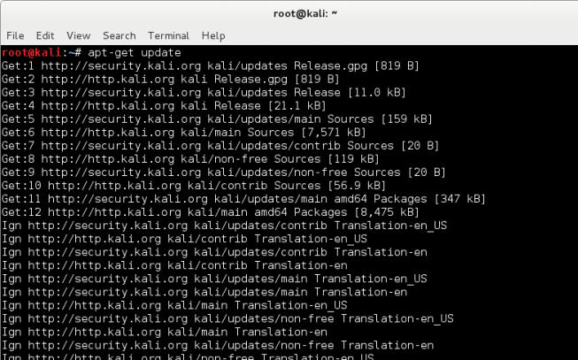
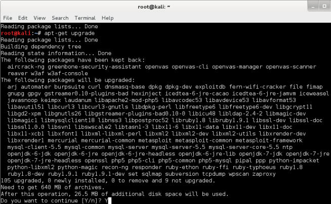

# 第一章 配置 Kali Linux

> 作者：Gilberto Najera-Gutierrez

> 译者：[飞龙](https://github.com/)

> 协议：[CC BY-NC-SA 4.0](http://creativecommons.org/licenses/by-nc-sa/4.0/)

## 简介

在第一章中，我们会涉及如何准备我们的 Kali 以便能够遵循这本书中的秘籍，并使用虚拟机建立带有脆弱 Web 应用的实验室。

## 1.1 升级和更新 Kali 

在我们开始 Web 应用安全测试之前，我们需要确保我们拥有所有必要的最新工具。这个秘籍涉及到使 Kali 和它的工具保持最新版本的基本步骤。

### 准备

我们从 Kali 已经作为主操作系统安装到计算机上，并带有网络连接来开始。这本书中所使用的版本为 2.0。你可以从 <https://www.kali.org/downloads/> 下载 live CD 和安装工具。

### 操作步骤

一旦你的 Kali 实例能够启动和运行，执行下列步骤：

1.  以 root 登录 Kali。默认密码是 toor，不带双引号。你也可以使用`su`来切换到该用户，或者如果喜欢使用普通用户而不是 root 的话，用`sudo`来执行单条命令。

2.  打开终端。

3.  运行`apt-get update`命令。这会下载可用于安装的包（应用和工具）的更新列表。

    ```
    apt-get update
    ```
    
    
    
4.  一旦安装完成，执行下列命令来将非系统的包更新到最新的稳定版。

    ```
    apt-get upgrade
    ```
    
    
    
5.  当被询问是否继续时，按下`Y`并按下回车。

6.  下面，让我们升级我们的系统。键入下列命令并按下回车：

    ```
    apt-get dist-upgrade
    ```
    
    
    
7.  现在，我们更新了 Kali 并准备好了继续。

### 工作原理

这个秘籍中，我们涉及到了更新基于 Debian 的系统（比如 Kali）的基本步骤。首先以`update`参数调用`apt-get`来下载在所配置的仓库中，用于我们的特定系统的包的最新列表。下载和安装仓库中最新版本的所有包之后，`dist-update`参数下载和安装`upgrade`没有安装的系统包（例如内核和内核模块）。

> 这本书中，我们假设 Kali 已经作为主操作系统在电脑上安装。也可以将它安装在虚拟机中。这种情况下，要跳过秘籍“安装 VirtualBox”，并按照“为正常通信配置虚拟机”配置 Kali VM 的网络选项。

### 更多

有一些工具，例如 Metasploit 框架，拥有自己的更新命令。可以在这个秘籍之后执行它们。命令在下面：

```
msfupdate 
```
