# 第一章 配置 Kali Linux

> 作者：Gilberto Najera-Gutierrez

> 译者：[飞龙](https://github.com/)

> 协议：[CC BY-NC-SA 4.0](http://creativecommons.org/licenses/by-nc-sa/4.0/)

## 简介

在第一章中，我们会涉及如何准备我们的 Kali 以便能够遵循这本书中的秘籍，并使用虚拟机建立带有存在漏洞的 Web 应用的实验室。

## 1.1 升级和更新 Kali 

在我们开始 Web 应用安全测试之前，我们需要确保我们拥有所有必要的最新工具。这个秘籍涉及到使 Kali 和它的工具保持最新版本的基本步骤。

### 准备

我们从 Kali 已经作为主操作系统安装到计算机上，并带有网络连接来开始。这本书中所使用的版本为 2.0。你可以从 <https://www.kali.org/downloads/> 下载 live CD 和安装工具。

### 操作步骤

一旦你的 Kali 实例能够启动和运行，执行下列步骤：

1.  以 root 登录 Kali。默认密码是 toor，不带双引号。你也可以使用`su`来切换到该用户，或者如果喜欢使用普通用户而不是 root 的话，用`sudo`来执行单条命令。

2.  打开终端。

3.  运行`apt-get update`命令。这会下载可用于安装的包（应用和工具）的更新列表。

    ```
    apt-get update
    ```
    
    
    
4.  一旦安装完成，执行下列命令来将非系统的包更新到最新的稳定版。

    ```
    apt-get upgrade
    ```
    
    
    
5.  当被询问是否继续时，按下`Y`并按下回车。

6.  下面，让我们升级我们的系统。键入下列命令并按下回车：

    ```
    apt-get dist-upgrade
    ```
    
    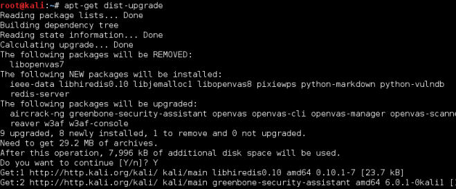
    
7.  现在，我们更新了 Kali 并准备好了继续。

### 工作原理

这个秘籍中，我们涉及到了更新基于 Debian 的系统（比如 Kali）的基本步骤。首先以`update`参数调用`apt-get`来下载在所配置的仓库中，用于我们的特定系统的包的最新列表。下载和安装仓库中最新版本的所有包之后，`dist-update`参数下载和安装`upgrade`没有安装的系统包（例如内核和内核模块）。

> 这本书中，我们假设 Kali 已经作为主操作系统在电脑上安装。也可以将它安装在虚拟机中。这种情况下，要跳过秘籍“安装 VirtualBox”，并按照“为正常通信配置虚拟机”配置 Kali VM 的网络选项。

### 更多

有一些工具，例如 Metasploit 框架，拥有自己的更新命令。可以在这个秘籍之后执行它们。命令在下面：

```
msfupdate 
```

## 1.2 安装和运行 OWASP Mantra

OWASP（开放 Web 应用安全项目，<https://www.owasp.org/>）中的研究员已经将 Mozilla FIrefox 与 大量的插件集成，这些插件用于帮助渗透测试者和开发者测试 Web 应用的 bug 或安全缺陷。这个秘籍中，我们会在 Kali 上安装 OWASP Mantra（<http://www.getmantra.com/>），首次运行它，并查看一些特性。

大多数 Web 应用渗透测试都通过浏览器来完成。这就是我们为什么需要一个带有一组工具的浏览器来执行这样一个任务。OWASP Mantra 包含一系列插件来执行任务，例如：

+   嗅探和拦截 HTTP 请求

+   调试客户端代码

+   查看和修改 Cookie

+   收集关于站点和应用的信息

### 准备

幸运的是， OWASP Mantra 默认包含于 Kali 的仓库中。所以，要确保我们获得了浏览器的最新版本，我们需要更新包列表：

```
apt-get update
```

### 操作步骤

1.  打开终端并执行：

    ```
    apt-get install owasp-mantra-ff
    ```
    
    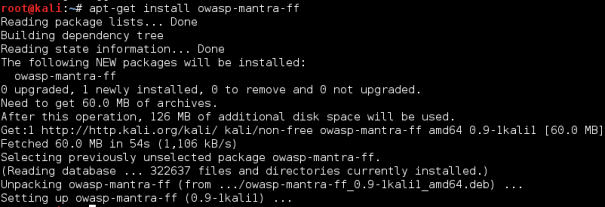
    
2.  在安装完成之后，访问菜单：` Applications | 03 - Web Application Analysis | Web Vulnerability Scanners | owasp-mantra-ff`来首次启动 Mantra。或者在终端中输入下列命令：

    ```
    owasp-mantra-ff
    ```
    
    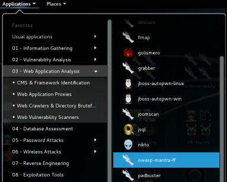
    
3.  在新打开的浏览器中，点击 OWASP 图标之后点击`Tools`。这里我们可以访问到所有 OWASP Mantra 包含的工具。

    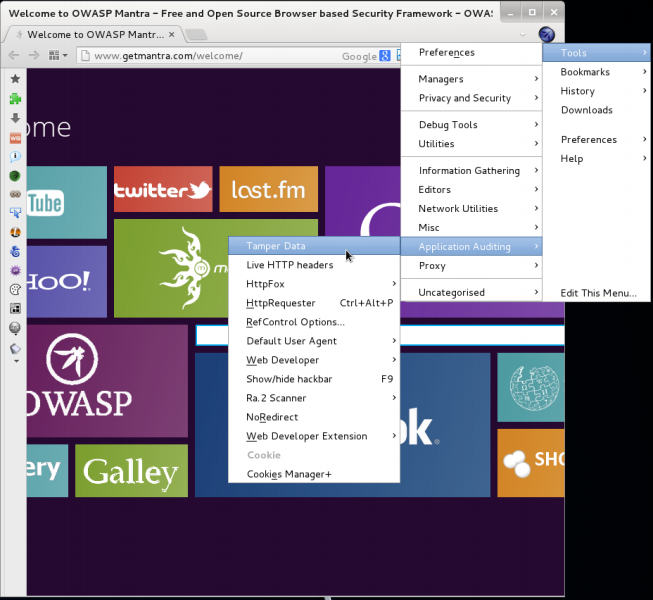
    
4.  我们会在之后的章节中使用这些工具。

### 另见

你可能也对 Mantra on Chromium （MOC）感兴趣，这是 Mantra 的一个替代版本，基于 Chromium 浏览器。当前，它只对 Windows 可用：<http://www.getmantra.com/mantra-on-chromium.html>。

## 1.3 配置 Iceweasel 浏览器

如果我们不喜欢 OWASP Mantra，我们可以使用 Firefox 的最新版本，并安装我们自己的测试相关插件。Kali Linux 包含了 Iceweasel，另一个 Firefox 的变体。我们这里会使用它来看看如何在它上面安装我们的测试工具。

### 操作步骤

1.  打开 Iceweasel 并访问`Tools | Add-ons`。就像下面的截图这样：

    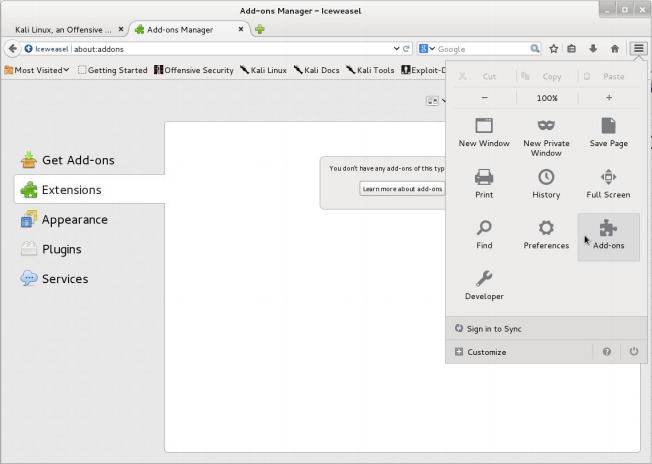
    
2.  在搜素框中，输入`tamper data `并按下回车。

    
    
3.  在`Tamper Data `插件中点击`Install`。

4.  对话框会弹出，询问我们接受 EULA，点击`Accept and Install...`。

    > 你可能需要重启你的浏览器来完成特定插件的安装。

5.  下面，我们在搜索框中搜索`cookies manager+ `。

6.  在`cookies manager+ `插件中点击`Install`。

7.  现在，搜索`Firebug`。

8.  搜索和安装`Hackbar`。

9.  搜索和安装` HTTP Requester`。

0.  搜索和安装`Passive Recon`。

### 工作原理

目前为止，我们在 Web 浏览器中安装了一些工具，但是对 Web 应用渗透测试者来说，这些工具好在哪里呢？

+   `Cookies Manager+`：这个插件允许我们查看，并有时候修改浏览器从应用受到的 Cookie 的值。

+   `Firebug`：这是任何 Web 开发者的必需品。它的主要功能是网页的内嵌调试器。它也在你对页面执行一些客户端修改时非常有用。

+   `Hackbar`：这是一个非常简单的插件，帮助我们尝试不同的输入值，而不需要修改或重写完整的 URL。在手动检查跨站脚本工具和执行注入的时候，我们会很频繁地使用它。

+   `Http Requester`：使用这个工具，我们就能构造 HTTP 链接，包括 GET、POST 和 PUT 方法，并观察来自服务器的原始响应。

+   `Passive Recon`：它允许我们获得关于网站被访问的公共信息，通过查询 DNS 记录、WHOIS、以及搜索信息，例如邮件地址、链接和 Google 中的合作者。

+   `Tamper Data`：这个插件能够在请求由浏览器发送之后，捕获任何到达服务器的请求。这提供给我们了在将数据引入应用表单之后，在它到达服务器之前修改它的机会。

### 更多

有一些插件同样对 Web 应用渗透测试者有用，它们是：

+ XSS Me 
+ SQL Inject Me 
+ FoxyProxy 
+ iMacros 
+ FirePHP 
+ RESTClient 
+ Wappalyzer

## 1.4 安装 VirtualBox

这是我们的第四篇秘籍，会帮助我们建立虚拟机环境，并运行它来实施我们的渗透测试。我们会使用 VirtualBox 在这样的环境中运行主机。这个秘籍中，我们会了解如何安装 VirtualBox 以及使它正常工作。

### 准备

在我们在 Kali 中安装任何东西之前，我们都必须确保我们拥有最新版本的包列表：

```
apt-get update
```

### 操作步骤

1.  我们首先实际安装 VirtualBox：

    ```
    apt-get install virtualbox
    ```
    
    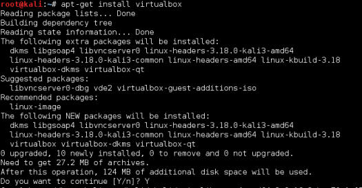
    
2.  安装完成之后，我们要在菜单中寻找 VirtualBox，通过访问`Applications | Usual applications | Accessories | VirtualBox`。作为替代，我们也可以从终端调用它：

    ```
    virtualbox
    ```
    
    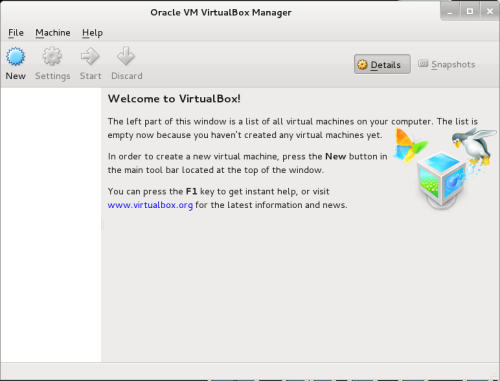
    
现在，我们运行了 VirtualBox 并且已经准备好配置虚拟机来构建我们自己的测试环境。

### 工作原理

VirtualBox 允许我们在我们的 Kali 主机上通过虚拟化运行多个主机。通过它，我们可以使用不同的计算机和操作系统来挂载完整的环境。并同时运行它们，只要 Kali 主机的内存资源和处理能力允许。

### 更多

虚拟机扩展包，提供了 VirtualBox 的虚拟机附加特性，例如 USB 2.0/3.0 支持和远程桌面功能。它可以从 <https://www.virtualbox.org/wiki/Downloads> 下载。在下载完成后双击它，VirtualBox 会做剩余的事情。

### 另见

除此之外有一些可视化选项。如果你使用过程中感到不方便，你可以尝试：

+ VMware Player/Workstation
+ Qemu
+ Xen
+ KVM

## 1.5 创建漏洞虚拟机

现在我们准备好创建我们的第一个虚拟机，它是托管 Web 应用的服务器，我们使用应用来实践和提升我们的渗透测试技巧。

我们会使用叫做 OWASP BWA（ Broken Web Apps）的虚拟机，它是存在漏洞的 Web 应用的集合，特别为执行安全测试而建立。

### 操作步骤

1.  访问 <http://sourceforge.net/projects/owaspbwa/files/>，并下载最新版本的`.ova`文件。在本书写作过程中，它是`OWASP_Broken_Web_Apps_ VM_1.1.1.ova`。

    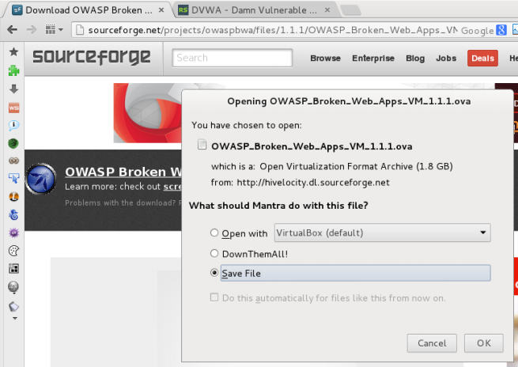
    
2.  等待下载完成，之后打开文件：

3.  VirtualBox 的导入对话框会显示。如果你打算修改机器名称或描述，你可以通过双击值来完成。我们会命名为`vulnerable_vm`，并且使剩余选项保持默认。点击`Import`。

4.  导入需要花费一分钟，之后我们会看到我们的虚拟机显示在 VirtualBox 的列表中。让我们选中它并点击`Start`。

5.  在机器启动之后，我们会被询问登录名和密码，输入`root`作为登录名，`owaspbwa`作为密码，这样设置。

    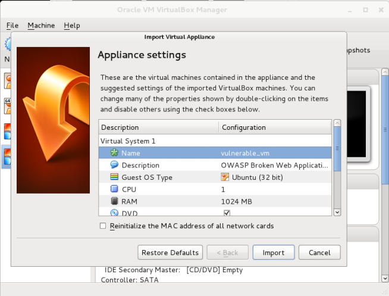
    
### 工作原理

OWASP BWA 是一个项目，致力于向安全从业者和爱好者提供安全环境，用于提升攻击技巧，并识别和利用 Web 应用中的漏洞，以便帮助开发者和管理员修复和防止漏洞。

这个虚拟机包含不同类型的 Web 应用，一些基于 PHP，一些基于 Java，甚至还有一些基于 .NET 的漏洞应用。也有一些已知应用的漏洞版本，例如 WordPress 或 Joomla。

### 另见

当我们谈论漏洞应用和虚拟机的时候，有很多选择。有一个著名网站含有大量的此类应用，它是 VulnHub（`https:// www.vulnhub.com/`）。它也有一些思路，帮助你解决一些挑战并提升你的技能。

这本书中，我们会为一些秘籍使用另一个虚拟机： bWapp Bee-box。它也可以从 VulnHub 下载：<https://www.vulnhub.com/entry/bwapp-beebox-v16,53/>。

## 1.6 获取客户端虚拟机

当我们执行中间人攻击（MITM）和客户端攻击时，我们需要另一台虚拟机来向已经建立的服务器发送请求。这个秘籍中，我们会下载 Microsoft Windows 虚拟机并导入到 VirtualBox 中。

### 操作步骤

1.  首先我们需要访问下载站点 <http://dev.modern.ie/tools/ vms/#downloads>。

2.  这本书中，我们会在 Win7 虚拟机中使用 IE8。

    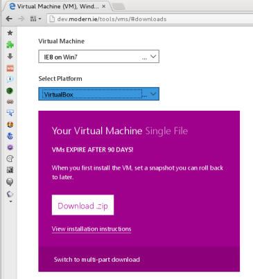
    
3.  文件下载之后，我们需要解压它。访问它下载的位置。

4.  右击它并点击`Extract Here`（解压到此处）。

5.  解压完成后，打开`.ova`文件并导入到 VirtualBox 中。

    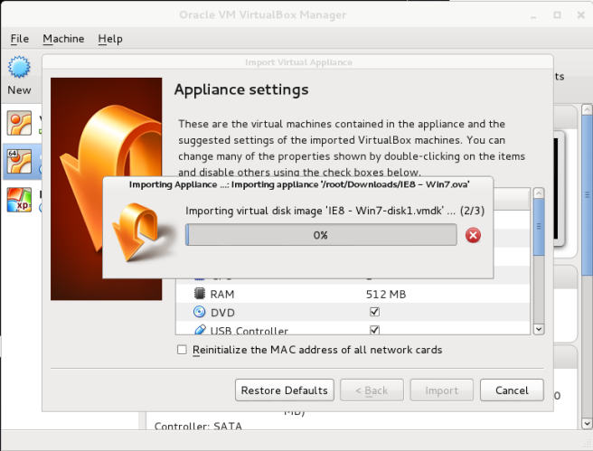
    
6.  现在启动新的虚拟机（名为`IE8 - Win7`），我们就准备好客户端了。

    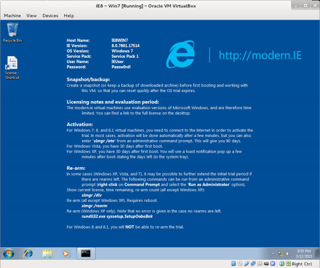

### 工作原理

Microsoft 向开发者提供了这些虚拟机来在不同的 Windows 和 IE 版本上测试它们的应用，带有 30 天的免费许可，这足以用于实验了。

作为渗透测试者，意识到真实世界的应用可能位于多个平台，这些应用的用户可能使用大量的不同系统和 Web 浏览器来和互相通信非常重要。知道了这个之后，我们应该使用任何客户端/服务器的设施组合，为成功的渗透测试做准备。

### 另见

对于服务端和客户端的虚拟机，如果你在使用已经构建好的配置时感到不便，你总是可以构建和配置你自己的虚拟机。这里是一些关于如何实现的信息：<https://www.virtualbox.org/manual/>。

## 1.7 为正常通信配置虚拟机

为了能够和我们的虚拟服务器和客户端通信，我们需要位于相同网段内。但是将带有漏洞的虚拟机放到局域网中可能存在安全风险。为了避免它，我们会在 VirtualBox 中做一个特殊的配置，允许我们在 Kali 中和服务器及客户端虚拟机通信，而不将它们暴露给网络。

### 准备

在我们开始之前，打开 VirtualBox 并且宝漏洞服务器和客户端虚拟机都关闭了。

### 操作步骤

1.  在 VirtualBox 中访问`File | Preferences… | Network`。

2.  选择`Host-only Networks`标签页。

3.  点击`+`按钮来添加新网络。

4.  新的网络（`vboxnet0`）会创建，它的详细窗口会弹出。如果没有，选项网络并点击编辑按钮来编辑它的属性。

    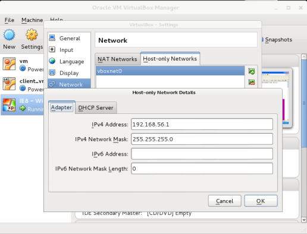
    
5.  在对话框中，你可以指定网络配置。如果它不影响你的本地网络配置，将其保留默认。你也可以修改它并使用其它为局域网保留的网段中的地址，例如 10.0.0.0/8、172.16.0.0/12、192.168.0.0/16。

6.  合理配置之后，点击`OK`。

7.  下一步是配置漏洞虚拟机（vulnerable_vm）。选择它并访问它的设置。

8.  点击`Network `并且在`Attached to:`下拉菜单中，选择` Host-only Adapter`。

9.  在`Name`中，选择`vboxnet0`。

0.  点击`OK`。

    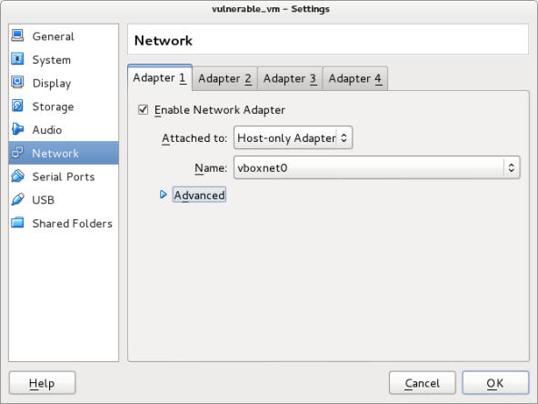
    
1.  在客户端虚拟机（`IE8 - Win7`）中执行第七步到第十步。

2.  在配置完两个虚拟机之后，让我们测试它们是否能真正通信。启动两个虚拟机。

3.  让我们看看宿主系统的网络通信：打开终端并输入：

    ```
    ifconfig
    ```
    
4.  我们可以看到我们拥有叫做`vboxnet0 `的网络适配器，并且它的 IP 地址为 192.168.56.1。取决于你所使用的配置，这可能有所不同。

5.  登录 vulnerable_vm 并检查适配器`eth0`的 IP 地址。

    ```
    ifconfig 
    ```

6.  现在，让我们访问我们的客户端主机`IE8 - Win7`。打开命令行提示符并输入：

    ```
    ipconfig 
    ```
    
7.  现在，我们拥有了三台机器上的 IP 地址。

    +   192.168.56.1 ：宿主机
    +   192.168.56.102 ：vulnerable_vm 
    +   192.168.56.103 ：IE8 - Win7

8.  为了测试通信，我们打算从宿主机中 ping 两个虚拟机。

    ```
    ping -c 4 192.168.56.102 
    ping -c 4 192.168.56.103
    ```
    
    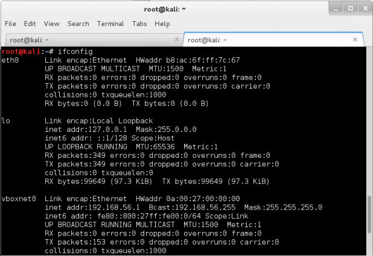
    
    ping 会发送 ICMP 请求给目标，并等待回复。这在测试网络上两个节点之间是否可以通信的时候非常有用。
    
9.  我们对两个虚拟机做相同操作，来检车到服务器和到另一台虚拟机的通信是否正常。

0.  IE8 - Win7 虚拟机可能不响应 ping，这是正常的，因为 Win7 的配置默认不响应 ping。为了检查连接性，我们可以从 Kali 主机使用`arping`。

    ```
    arping –c 4 192.168.56.103
    ```
    
### 工作原理

仅有主机的网络是虚拟网络，它的行为像 LAN，但是它仅仅能够访问宿主机，所运行的虚拟机不会暴露给外部系统。这种网络也为宿主机提供了虚拟适配器来和虚拟机通信，就像它们在相同网段那样。

使用我们刚刚完成的配置，我们就能够在客户端和服务器之间通信，二者都可以跟 Kali 主机通信，Kali 会作为攻击主机。
