# 第三章 爬虫和蜘蛛

> 作者：Gilberto Najera-Gutierrez

> 译者：[飞龙](https://github.com/)

> 协议：[CC BY-NC-SA 4.0](http://creativecommons.org/licenses/by-nc-sa/4.0/)

## 简介

渗透测试可以通过多种途径完成，例如黑盒、灰盒和白盒。黑盒测试在测试者没有任何应用的前置信息条件下执行，除了服务器的 URL。白盒测试在测试者拥有目标的全部信息的条件下执行，例如它的构造、软件版本、测试用户、开发信息，以及其它。灰盒测试是黑盒和白盒的混合。

对于黑盒和灰盒测试，侦查阶段对测试者非常必然，以便发现白盒测试中通常由应用所有者提供的信息。

我们打算采取黑盒测试方式，因为它涉及到外部攻击者用于获取足够信息的所有步骤，以便入侵应用或服务器的特定功能。

作为每个 Web 渗透测试中侦查阶段的一部分，我们需要浏览器每个包含在网页中的链接，并跟踪它展示的每个文件。有一些工具能够帮助我们自动和以及加速完成这个任务，它们叫做 Web 爬虫或蜘蛛。这些工具通过跟随所有到外部文件的链接和引用，有的时候会填充表单并将它们发送到服务器，保存所有请求和响应来浏览网页，从而提供给我们离线分析它们的机会。

这一章中，我们会涉及到一些包含在 Kali 中的爬虫的使用，也会查看我们感兴趣的文件和目录，来寻找常见的网页。

## 3.1 使用 Wget 为离线分析下载网页

Wget 是 GNU 项目的一部分，也包含在主流 linux 发行版中，包括 Kali。它能够递归为离线浏览下载网页，包括链接转换和下载非 HTML 文件。

这个秘籍中，我们会使用 Wget 来下载和 vulnerable_vm 中的应用相关的页面。

### 准备

这一章的所有秘籍都需要运行 vulnerable_vm。在这本书的特定场景中，它的 IP 地址为 192.168.56.102。

### 操作步骤

1.  让我们做第一次尝试，通过仅仅以一个参数调用 Wget 来下载页面。

    ```
    wget http://192.168.56.102/bodgeit/
    ```
    
    
    
    我们可以看到，它仅仅下载了`index.html`文件到当前目录，这是应用的首页。
    
2.  我们需要使用一些选项，告诉 Wget 将所有下载的文件保存到特定目录中，并且复制我们设为参数的 URL 中包含的所有文件。让我们首先创建目录来保存这些文件：

    ```
    mkdir bodgeit_offline
    ```
    
3.  现在，我们会递归下载应用中所有文件并保存到相应目录中。

    ```
    wget -r -P bodgeit_offline/ http://192.168.56.102/bodgeit/

    ```
    
    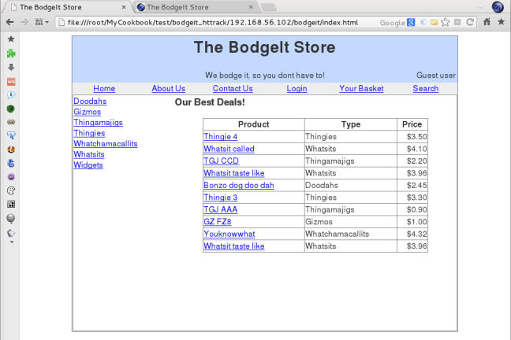
    
### 工作原理

像之前提到的那样，Wget 是个为下载 HTTP 内容创建的工具。通过`-r`参数，我们可以使其递归下载，这会按照它所下载的每个页面的所有连接，并同样下载它们。`-P`选项允许我们设置目录前缀，这是 Wget 会开始保存下载内容的目录。默认它设为当前目录。

### 更多

在我们使用 Wget 时，可以考虑一些其它的实用选项：

+   `-l`：在递归下载的时候，规定 Wget 的遍历深度可能很有必要。这个选项后面带有我们想要遍历的层级深度的数值，让我们规定这样的界限。

+   `-k`：在文件下载之后，Wget 修改所有链接，使其指向相应的本地文件，这会使站点能够在本地浏览。

+   `-p`：这个选项让 Wget 下载页面所需的所有图像，即使它们位于其它站点。

+   `-w`：这个选项让 Wget 在两次下载之间等待指定的描述。当服务器中存在防止自动浏览的机制时，这会非常有用。

## 3.2 使用 HTTrack 为离线分析下载页面

就像 HTTrack 的官网所说（`http://www.httrack.com`）：

> 它允许你从互联网下载 WWW 站点到本地目录中，递归构建所有目录、从服务器获得 HTML、图像，和其它文件到你的计算机中。

我们在这个秘籍中会使用 HTTrack 来下载应用站点的所有内容。

### 准备

HTTrack 没有默认在 Kali 中安装。所以我们需要安装它。

```
apt-get update 
apt-get install httrack
```

### 操作步骤

1.  我们的第一步是创建目录来储存下载的站点，输入：

    ```
    mkdir bodgeit_httrack 
    cd bodgeit_httrack
    ```
    
2.  使用 HTTrack 的最简单方式就是向命令中添加我们打算下载的 URL。

    ```
    httrack http://192.168.56.102/bodgeit/ 
    ```
    
    设置最后的`/`非常重要，如果遗漏了的话，HTTrack 会返回 404 错误，因为服务器根目录没有`bodgeit`文件。
    
    
    
3.  现在，如果我们访问文件` file:///root/MyCookbook/test/bodgeit_httrack/index. html`（或者你在你的测试环境中选择的目录），我们会看到，我们可以离线浏览整个站点：

    
    
### 工作原理

HTTrack 创建站点的完整静态副本，这意味着所有动态内容，例如用户输入的响应，都不会有效。在我们下载站点的文件夹中，我们可以看到下列文件和目录：

+   以服务器名称或地址命名的目录，包含所有下载的文件。

+   `cookies.txt`文件，包含用于下载站点的 cookie 信息。

+   `hts-cache`目录包含由爬虫检测到的文件列表，这是 httrack 所处理的文件列表。

+   `hts-log.txt `文件包含错误、警告和其它在爬取或下载站点期间的信息

+   ` index.html`文件重定向到副本的原始主页，它位于名称为服务器的目录中。

### 更多

HTTrack 也拥有一些扩展选项，允许我们自定义它的行为来更好符合我们的需求。下面是一些值得考虑的实用修改器：

+   `-rN`：将爬取的链接深度设置为 N。
+   `-%eN`：设置外部链接的深度界限。
+   `+[pattern]`：告诉 HTTrack 将匹配`[pattern]`的 URL 加入白名单，例如`+*google.com/*`。
+   `-[pattern]`：告诉 HTTrack 将匹配`[pattern]`的 URL 加入黑名单。
+   `-F [user-agent]`：允许我们定义用于下载站点的 UA（浏览器标识符）。

## 3.3 使用 ZAP 蜘蛛

在我们的计算机中将完整的站点下载到目录给予我们信息的静态副本，这意味着我们拥有了不同请求产生的输出，但是我们没有服务器的请求或响应状态。为了拥有这种信息的记录，我们需要使用蜘蛛，就像 OWASP ZAP 中集成的这个。

这个秘籍中，我们会使用 ZAP 的蜘蛛来爬取 vulnerable_vm 中的目录，并检查捕获的信息。

### 准备

对于这个秘籍，我们需要启动  vulnerable_vm 和 OWASP ZAP，浏览器需要配置来将 ZAP 用做代理。这可以通过遵循上一章中“使用 ZAP 发现文件和文件夹”中的指南来完成。

### 操作步骤

1.  为了让 ZAP 启动并使浏览器将其用作代理，浏览`http://192.168.56.102/bodgeit/`。

2.  在`Sites`标签页中，打开对应测试站点的文件夹（本书中是`http://192.168.56.102`）。

3.  右击`GET:bodgeit`。

4.  从下拉菜单中选择` Attack | Spider…`。

    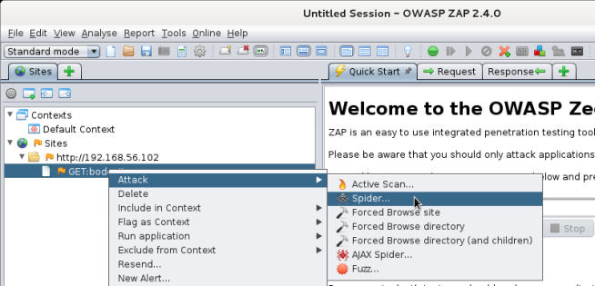

5.  在对话框中，保留所有选项为默认并点击`Start Scan`。

6.  结果会出现在`Spider`标签页的底部面板中。

    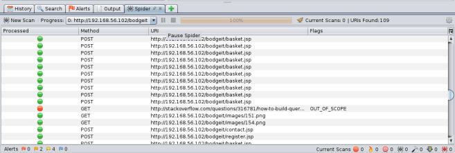

7.  如果我们打算分析独立文件的请求和响应，我们访问`Sites`标签并打开其中的`site`文件夹和`bodget`文件夹。让我们看一看`POST:contact.jsp(anticsrf,comments,null)`。

    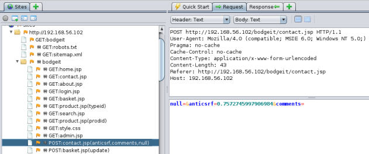
    
    在右边，我们可以看到完整的请求，包含所使用的参数（下半边）。
    
8.  现在，选择右侧部分的`Reponse`标签页。

    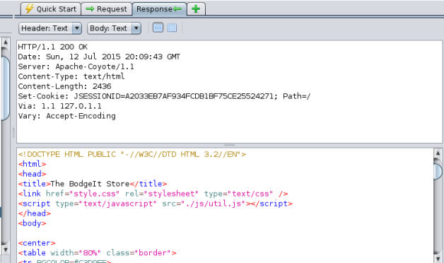
    
    在上半边中，我们可以看到响应头，包括服务器标识和会话 Cookie，在下版本我们拥有完整的 HTML 响应。在之后的章节中，我们会了解从已授权的用户获取这种 cookie，如何用于劫持用户会话以及执行冒充它们的操作。
    
### 工作原理

就像任何其它爬虫那样，ZAP 的蜘蛛跟随它找到的每个链接，位于每个包含请求范围以及其中的链接中的页面上。此外，蜘蛛会跟随表单响应、重定向和包含在`robots.txt `和`sitemap.xml`文件中的 URL。之后它会为之后分析和使用储存所有请求和响应、

### 更多

在爬取站点或目录之后，我们可能打算使用储存的请求来执行一些测试。使用 ZAP 的功能，我们能够执行下列事情：

+   在修改一些数据之后重放请求
+   执行主动和被动漏洞扫描
+   模糊测试输入参数来寻找可能的攻击向量
+   在浏览器中重放特定请求

## 3.4 使用 Burp Suite 爬取站点

Burp 几乎是最广泛用于应用渗透测试的工具，因为它拥有类似 ZAP 的功能，并含有一些独特的特性和易用的界面。Burp 不仅仅能够用于爬取站点，但是现在，作为侦查阶段的一部分，我们先涉及这个特性。

### 准备

通过访问 Kali 的`Applications `菜单，之后访问`03 Web Application Analysis | Web Application Proxies | burpsuite`来启动 Burp Suite，就像下面这样：

    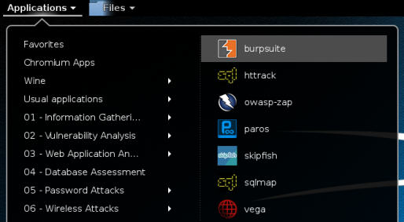
    
之后配置浏览器将其用做代理，通过 8080 端口，就像我们之前使用 ZAP 的那样。

### 操作步骤

1.  Burp 的代理默认配置为拦截所有请求，我们需要禁用它来不带拦截浏览。访问`Proxy`标签页并点击` Intercept is on `按钮，它就会变为`Intercept is off`，像这样：

    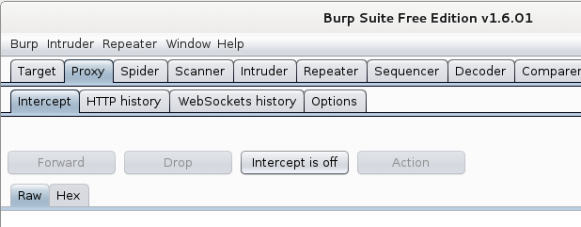
    
2.  现在，在浏览器中，访问` http://192.168.56.102/bodgeit/`。

3.  在 Burp 的窗口中，当我们访问`Target`的时候，我们会看到其中含有我们正在浏览器的站点信息，以及浏览器产生的请求。

    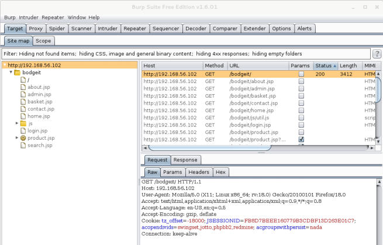
    
4.  现在，为了激活蜘蛛，我们右击`bodgeit `文件夹，并从菜单中选择`Spider this branch`。

    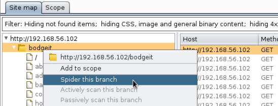

5.  Burp 会询问我们是否添加项目到这里，我们点击`Yes`。通常，Burp 的蜘蛛只爬取匹配定义在`Target `标签页中的`Scope`标签页中的模式的项目。

6.  之后，蜘蛛会开始运行。当它检测到登录表单之后，它会向我们询问登录凭据。我们可以忽略它，蜘蛛会继续，或者我们可以提交一些测试值，蜘蛛会填充这些值到表单中。让我们将两个字段，用户名和密码都填充为单词`test`，并点击`Submit form`：

    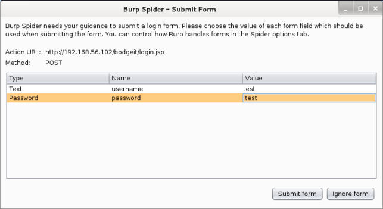
    
7.  下面，我们会要求在注册页中填充用户名和密码。我们通过点击`Ignore form`来忽略它。

8.  我们可以在`Spider`标签页中检查蜘蛛的状态。我们也可以通过点击` Spider is running `按钮来停止它。让我们现在停止它，像这样：

    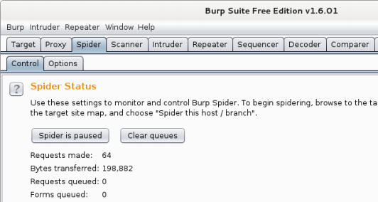
    
9.  我们可以在`Site map`标签页中检查蜘蛛生成的结果，它在`Target`中。让我们查看我们之前填充的登录请求：

    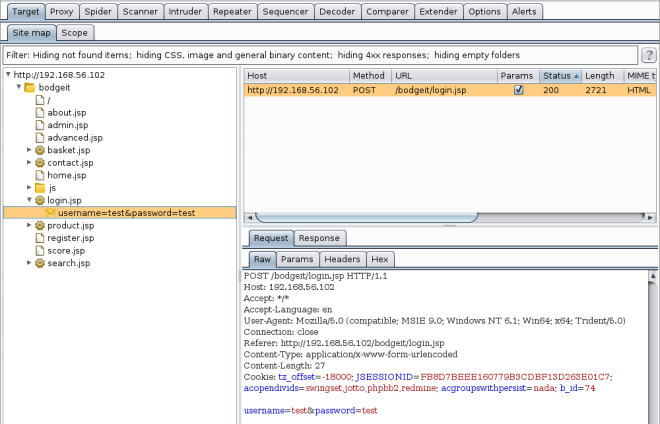
    
### 工作原理

Burp 的蜘蛛遵循和其它蜘蛛相同的方式，但是它的行为有一些不同，我们可以让它在我们浏览站点的时候运行，它会添加我们跟随（匹配范围定义）的链接到爬取队列中。

就像 ZAP 那样，我们可以使用 Burp 的爬取结果来执行任何操作。我们可以执行任何请求，例如扫描（如果我们拥有付费版）、重放、比较、模糊测试、在浏览器中查看，以及其它。

## 3.5 使用 Burp 重放器重放请求

在分析蜘蛛的结果以及测试可能的表单输入时，发送相同请求的修改特定值的不同版本可能很实用。

这个秘籍中，我们会学到如何使用 Burp 的重放器来多次发送带有不同值的请求。

### 准备

我们从前一个秘籍的地方开始这个秘籍。启动 vulnerable_vm 虚拟机和 Burp 以及将浏览器合理配置来将 Burp 用做代理非常必要。

### 操作步骤

1.  我们的第一步是访问`Target`标签，之后访问蜘蛛所生成的登录页面请求（`http://192.168.56.102/bodgeit/login.jsp`），带有`username=test&password=test`的那个。

2.  右击请求并从菜单中选择`Send to Repeater`，像这样：

    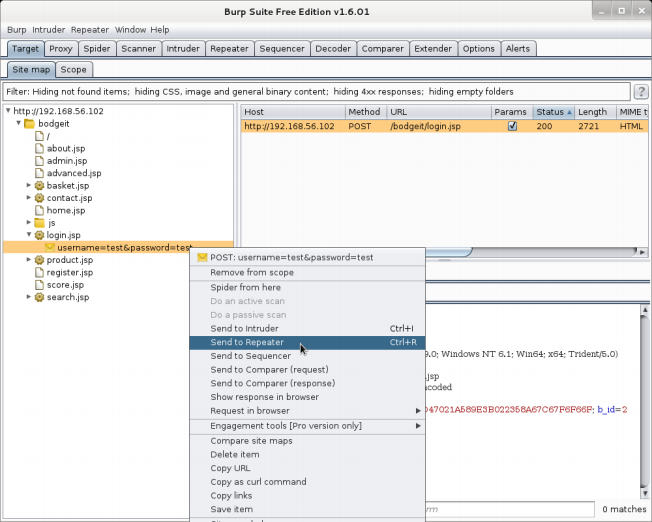
    
3.  现在我们切换到`Repeater`标签页。

4.  让我们点击`Go`来在右侧查看服务器的响应。

    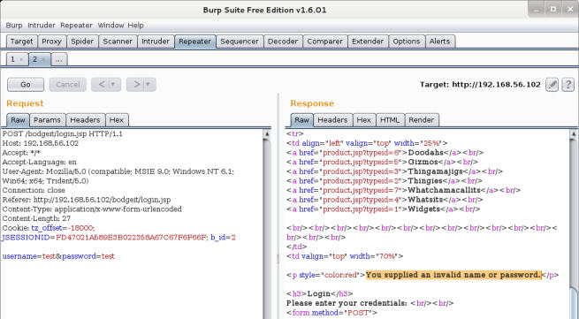
    
    在`Request`部分（图像左侧）中，我们可以看到发给服务器的原始请求。第一行展示了所使用的方法：POST，被请求的 URL 和协议：HTTP 1.1。下面一行，一直到 Cookie，都是协议头参数，在它们后面我们看到一个换行，之后是我们在表单输入的 POST 参数和值。
    
5.  在响应部分我们看到了一些标签页：`Raw`、`Headers`、`Hex`、`HTML`和`Render`。这些以不同形式展示相同的响应信息。让我们点击`Render`来查看页面，就像在浏览器中那样：

    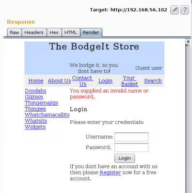
    
6.  我们可以在请求端修改任何信息。再次点击`OK`并检查新的响应。对于测试目的，让我们将密码值替换为一个单引号，并发送请求。

    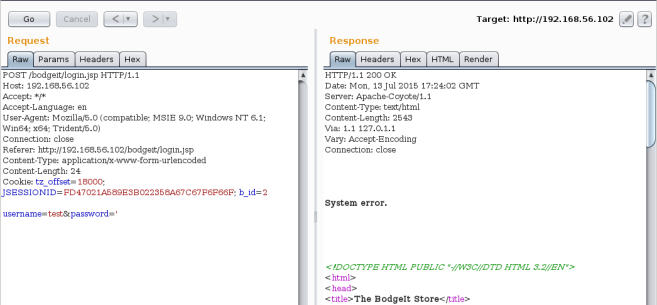
    
    我们可以看到，我们通过修改输入变量的值触发了系统错误。这可能表明应用中存在漏洞。在后面的章节中，我们会涉及到漏洞的测试和识别，并深入探索它。
    
### 工作原理

Burp 的重放器允许我们手动为相同的 HTTP 请求测试不同的输入和场景，并且分析服务器提供的响应。这在测试漏洞的时候非常实用，因为测试者可以了解应用如何对多种所提供的输入反应，以及从而识别或利用设计、编程或配置中的可能缺陷。

## 3.6 使用 WebScarab

WebScarab 是另一个 Web 代理，拥有让渗透测试者感兴趣的特性。这个秘籍中，我们会使用它来爬取网站。

### 准备

作为默认配置，WebScarab 实用 8008 端口来捕获 HTTP 请求。所以我们需要配置我们的浏览器来在 localhost 中使用这个端口作为代理。你需要遵循与在浏览器中配置 OWASP ZAP、Burp Suite 的相似步骤。这里，端口必须是 8008。

### 操作步骤

1.  在 Kali 的`Applications `菜单中，访问` 03 Web Application Analysis | webscarab`来打开WebScarab。

2.  浏览vulnerable_vm 的 Bodgeit 应用（`http://192.168.56.102/ bodgeit/`）。我们会看到它出现在 WebScarab 的`Summary`标签页中。

3.  现在，右击 bodgeit 文件夹并从菜单选择` Spider tree `，像这样：

    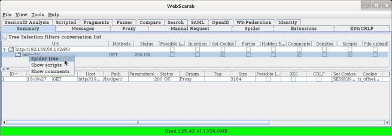
    
4.  在蜘蛛发现新文件过程中，所有请求会出现在概览的下半部分，树也会被填满。

    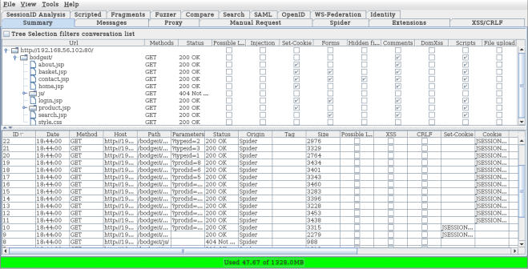
    
    这个概览也展示了一些关于每个特定文件的相关信息。例如，是否存在注入或者可能为注入的漏洞，是否设置了 cookie，包含表单，或者是否表单含有隐藏字段。它也表明了代码或文件上传中存在注释。
    
5.  如果我们右击任何下半部分的请求，我们会看到可以对它们执行的操作。我们分析请求，找到路径`/bodgeit/search.jsp`，右击它，并选择Show conversation`。新的窗口会弹出，并以多种格式展示响应和请求，就像下面这样：

    
    
6.  现在点击`Spider`标签页。

    
    
    这个标签页中，我们可以在` Allowed Domains` 和 `Forbidden Domains`中，使用正则表达式来调整蜘蛛抓取的内容。我们也可以使用`Fetch Tree`来刷新结果。我们也可以通过点击`Stop`按钮来停止蜘蛛。
    
### 工作原理

WebScarab 的蜘蛛类似于 ZAP 或者 Burp Suite，对发现网站中所有被引用文件或目录，而无需手动浏览器所有可能的链接，以及深度分析发给服务器的请求，并使用它们执行更多复杂的测试非常实用。
