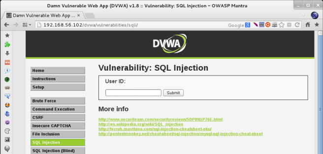
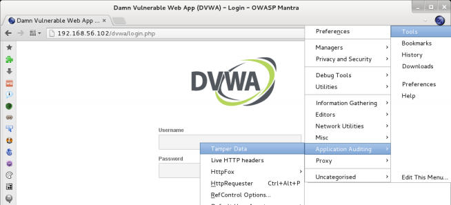
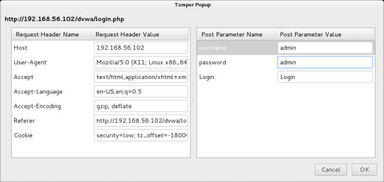
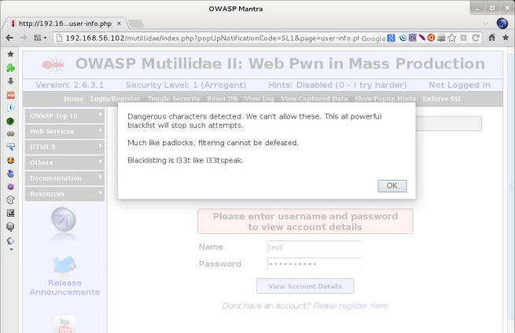
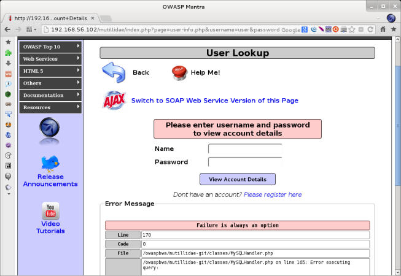

# 第四章 漏洞发现

> 作者：Gilberto Najera-Gutierrez

> 译者：飞龙

> 协议：CC BY-NC-SA 4.0

## 简介

我们现在已经完成了渗透测试的侦查阶段，并且识别了应用所使用的服务器和开发框架的类型，以及一些可能的弱点。现在是实际测试应用以及检测它的漏洞的时候了。

这一章中，我们会涉及到检测一些 Web 应用中常见漏洞的过程，以及允许我们发现和利用它们的工具。

我们也会用到 vulnerable_vm 中的应用，我们会使用 OWASP Mantra 作为浏览来执行这些测试。

## 4.1 使用 Hackbar 插件来简化参数分析

在测试 Web 应用时，我们需要和浏览器的地址栏交互，添加或修改参数，以及修改 URL。一些服务器的相应会包含重定向，刷新以及参数修改。所有这些改动都会使对相同变量尝试不同值的操作非常费时间。我们需要一些工具来使它们不那么混乱。

Hackbar 是 Firefox 插件，它的行为就像地址栏，但是不受由服务器响应造成的重定向或其它修改影响，这就是我们需要测试 Web 应用的原因。

这个秘籍中，我们会使用 Hackbar 来简化相同请求的不同版本的发送工作。

### 准备

如果你没有使用  OWASP Mantra，你需要在你的 Firefox 上安装 Hackbar。

### 操作步骤

1.  访问 DVWA 并且登录。默认的用户名/密码组合是`admin/admin`。

2.  在左侧的菜单上选择`SQL Injection`（SQL 注入）。

    
    
3.  在` User ID `输入框中输入数字，并点击`Submit`（提交）。

    现在我们可以按下`F9`或者点击图标来显示 Hackbar。
    
    
    
    Hackbar 会赋值 URL 及其参数。我们也可以开启修改 POST 请求和 Referer 参数的选项。后者告诉服务器页面从哪里被请求。
    
4.  让我们做个简单的改动，将`id`参数值从`1`改成`2`，并点击`Execute`（执行）或者使用` Alt + X`快捷键。

    
    
    我们可以看到，参数`id`对应页面上的文本框，所以，我们可以使用 Hackbar 修改`id`来尝试任何值，而不需要修改文本框中的`User ID`并提交它。在测试拥有许多输入的表单，或者取决于输入重定向到其它页面的表单时，这非常便利。
    
5.  我们可以将一个有效值替换为另一个，但是如果我们引入了一个无效值作为`id`，会发生什么呢？尝试将单引号作为`id`：

    
    
    通过引入应用非预期的字符，我们触发了一个错误，这在之后测试一些漏洞的时候非常有用。
    
### 工作原理

Hackbar 是带有一些实用特性的第二个地址栏，比如不受 URL 重定向影响，并且允许我们修改 POST 参数。

此外，Hackbar 可用于向我们的请求中添加 SQL 注入或跨站脚本代码段，以及哈希、加密和编码我们的输入。我们会在这一章后面的秘籍中深入探索 SQL 注入、跨站脚本，以及其他漏洞。

## 4.2 使用 Tamper Data 插件拦截或修改请求

有时候，应用拥有客户端的输入校验机制，它们通过 JavaScript，隐藏表单或者 POST 数据，并不能直接在地址栏中了解或看到。为了测试这些以及其它类型的变量，我们需要拦截浏览器发送的请求并且在它们到达服务器之前修改它们。这个秘籍中，我们会使用叫做 Tamper Data 的 Firefox 插件来拦截表单提交并且在它离开计算机之前修改一些值。

### 操作步骤

1.  从 Mantra 的菜单中访问 `Tools | Application Auditing | Tamper Data`。

    
    
2.  会出现 Tamper Data 的窗口。现在，让我们浏览 < http://192.168.56.102/dvwa/login.php>。我们可以在插件中看到请求会话。

    
    
    > 每个浏览器产生的请求都会在活动时经过 Tamper Data。
    
3.  为了拦截请求并修改它的值，我们需要通过点击`Start  Tamper`来启动 Tamper。现在启动 Tamper。

4.  引入一些伪造的用户名密码组合。例如，` test/password`，之后点击`Login`。

5.  在确认框中，取消勾选` Continue Tampering?`并点击`Tamper`。`Tamper Popup`窗口会出现。

6.  在弹出窗口中，我们可以修改发送给服务器的信息，包括请求头和 POST 参数。将`username`和`password`改为正确的（`admin/admin`），之后点击`OK`。这应该在本书中使用，而不是 DVWA：

    
    
    在最后一步中，我们在表单中的值由浏览器发送给服务器之前修改了它们。因此，我们可以以正确的凭证而不是错误的凭证登录服务器。
    
### 工作原理

Tamper Data 会在请求离开浏览器之前捕获请求，并提供给我们时间来修改它包含的任何变量。但是，它也有一些限制，例如不能编辑 URL 或 GET 参数。

## 4.3 使用 ZAP 来查看和修改请求

虽然 Tamper Data 有助于测试过程，有时我们需要更灵活的方法来修改请求以及更多特性，例如修改用于发送它们的方法（即从 GET 改为 POST），或者使用其它工具为进一步的目的保存请求/响应对。

OWASP ZAP 不仅仅是 Web 代码，它不仅仅能够拦截流量，也拥有许多在上一章所使用的，类似于爬虫的特性，还有漏洞扫描器，模糊测试器，爆破器，以及其它。它也拥有脚本引擎，可以用于自动化操作或者创建新的功能。

这个秘籍中，我们会开始将 OWASP ZAP 用作代理，拦截请求，并在修改一些值之后将它发送给服务器。

### 准备

启动 ZAP 并配置浏览器在通过它发送信息。

### 操作步骤

1.  访问 <http://192.168.56.102/mutillidae/>。

2.  现在，访问菜单栏中的`OWASP Top 10 | A1 – SQL Injection | SQLi – Extract Data | User Info`。

3.  下一步是提升应用的安全等级。点击` Toggle Security`。现在`Security Level`应该是` 1 (Arrogant)`。

4.  将`test'`（包含单引号）作为`Name`，以及` password'`作为`Password`，并且点击` View Account Details`。

    

    我们得到了警告消息，告诉我们输入中的一些字符不合法。这里，单引号被检测到了，并被应用的安全手段中止。
    
5.  点击`OK`来关闭警告。

    如果我们在 ZAP 中检查历史，我们可以看到没有发给服务器的请求，这是由于客户端校验机制。我们会使用请求拦截来绕过这个保护。
    
6.  现在我们开启请求拦截（在 ZAP 叫做断点），通过点击`"break on all requests`（中断所有请求）按钮。

    
    
7.  下面，我们引入了有效值`Name`和`Password`，就像`test`和`password`，并再次检查细节。

    ZAP 会转移焦点，并打开叫做`Break`的新标签页。这里是刚刚在页面上产生的请求，我们可以看到一个 GET 请求，带有在 URL 中发送的`username`和`password`参数。我们可以添加上一次尝试中不允许的单引号。
    
    
    
8.  为了继续而不会被 ZAP 打断，我们通过点击`Unset Break`按钮来禁用断点。

    
    
9.  通过播放按钮来提交修改后的请求。

    
    
    我们可以看到，应用在顶部提供给我们错误信息，所以这是它的保护机制，它在客户端检查用户输入，但是在服务端并没有准备好处理非预期的请求。
    
### 工作原理

这个秘籍中，我们使用 ZAP 代理来拦截有效的请求，将它修改为无效或而已请求，之后把它发给服务器并且触发非预期的行为。

前三步用于开启安全保护，便于应用可以将单引号检测为无效字符。

之后，我们产生测试请求，并证实了会执行一些校验。提示警告的时候，没有请求通过代理，这告诉了我们检验是在客户端进行的，可能使用 JavaScript。知道了这个之后，我们产生了合法的请求，并使用代理来拦截它，这让我们能够绕过客户端的保护。我们将该请求转换为恶意请求，并把它发给服务器，这使它不能被正确处理，并返回错误。
