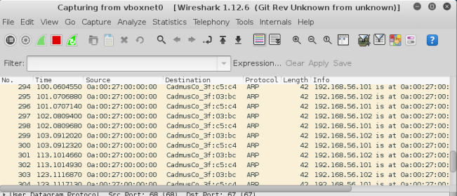

# 第八章 中间人攻击

> 作者：Gilberto Najera-Gutierrez

> 译者：[飞龙](https://github.com/)

> 协议：[CC BY-NC-SA 4.0](http://creativecommons.org/licenses/by-nc-sa/4.0/)

## 简介

中间人（MITM）攻击是一种攻击类型，其中攻击者将它自己放到两方之间，通常是客户端和服务端通信线路的中间。这可以通过破坏原始频道之后拦截一方的消息并将它们转发（有时会有改变）给另一方来实现。

让我们观察下面这个例子：


Alice 连接到了 Web 服务器上，Bob打算了解 Alice 正在发送什么信息。于是 Bob 建立 MITM 攻击，通过告诉服务器他是 Alice，并且告诉 Alice 他是服务器。现在，所有 Alice 的请求都会发给 Bob，Bob 会将它们转发给服务器，并对服务器的响应做相同操作。这样，Bob 就能够拦截、读取或修改所有 Alice 和服务器之间的流量。

虽然 MITM 攻击并不特定与 Web 攻击，了解如何执行它们，以及如何防止它们，对于任何渗透测试者都非常重要，因为它们可以用于偷取密码，劫持会话，或者执行 Web 应用中的非授权操作。

这一章中，我们会建立起中间人攻击，并使用它来获得信息，以及执行更加复杂的攻击。

## 8.1 使用 Ettercap 执行欺骗攻击

地址解析协议（ARP）欺骗可能是最常见的 MITM 攻击。它基于一个事实，就是 ARP 并不验证系统所收到的响应。这就意味着，当 Alice 的电脑询问网络上的所有设备，“IP 为 xxx.xxx.xxx.xxx 的机器的 MAC 地址是什么”时，它会信任从任何设备得到的答复。该设备可能是预期的服务器，也可能是不是。ARP 欺骗或毒化的工作方式是，发送大量 ARP 响应给通信的两端，告诉每一端攻击者的 MAC 地址对应它们另一端的 IP 地址。

这个秘籍中，我们会使用Ettercap 来执行 ARP 欺骗攻击，并将我们放到客户端和服务器之间。

### 准备

对于这个秘籍，我们会使用第一章配置的客户端虚拟机，和vulnerable_vm。客户端的 IP 是 192.168.56.101，vulnerable_vm 是 192.168.56.102。

### 操作步骤

1.  将两个虚拟机打开，我们的 Kali Linux（192.168.56.1）主机是攻击者的机器。打开终端窗口并输入下列命令：

    ```
    ettercap –G 
    ```
    
    从 Ettercap 的主菜单中，选择`Sniff | Unified Sniffing`。
    
2.  在弹出的对话框中选择你打算使用的网络接口，这里我们选择`vboxnet0`，像这样：

    
    
3.  既然我们嗅探了网络，下一步就是识别哪个主机正在通信。访问主菜单的`Hosts`之后选择`Scan for hosts`。

4.  从我们发现的主机中，选择我们的目标。从`Hosts `菜单栏中选择`Hosts list`。

    
    
5.  从列表中选择`192.168.56.101`，并点击`Add to Target 1`。

6.  之后选择`192.168.56.102 `，之后点击`Add to Target 2`。

7.  现在我们检查目标：在`Targets`菜单中，选择` Current targets`。

    

8.  我们现在准备好了开始欺骗攻击，我们的位置在服务器和客户端中间，在`Mitm `菜单中，选择`ARP poisoning`。

9.  在弹出的窗口中，选中`Sniff remote connections`，然后点击`OK`。

    

这就结束了，我们现在可以看到在客户端和服务端之间的流量。

### 工作原理

在我们键入的第一个命令中，我们告诉 Ettercap 启动 GTK 界面。

> 其它界面选项为`-T`启动文本界面，`-C`启动光标（以 ASCII 文本），`-D`运行为守护进程，没有界面。

之后，我们启动了 Ettercap 的嗅探功能。统一模式意味着我们会通过单一网络接口接受并发送信息。当我们的目标通过不同网络接口到达时，我们选择桥接模式。例如，如果我们拥有两个网卡，并且通过其一连接到客户端，另一个连接到服务端。

在嗅探开始之后，我们选择了目标。

> 事先选择你的目标

> 单次攻击中，选择唯一必要主机作为目标非常重要，因为毒化攻击会生成大量网络流量，并导致所有主机的性能问题。在开始 MITM 攻击之前，弄清楚那两个系统会成为目标，并仅仅欺骗这两个系统。

一旦设置了目标，我们就可以开始 ARP 毒化攻击。`Sniffing remote connections`意味着 Ettercap 会捕获和读取所有两端之间的封包，`Only poison one way`在我们仅仅打算毒化客户端，而并不打算了解来自服务器或网关的请求时（或者它拥有任何对 ARP 毒化的保护时）非常实用。

## 8.2 使用 Wireshark 执行 MITM 以及捕获流量

Ettercap 可以检测到经过它传播的相关信息，例如密码。但是，在渗透测试的时候，它通常不足以拦截一些整数，我们可能要寻找其他信息，类似信用卡的号码，社会安全号码，名称，图片或者文档。拥有一个可以监听网络上所有流量的工具十分实用，以便我们保存和之后分析它们。这个工具是个嗅探器，最符合我们的目的的工具就是 Wireshark，它包含于 Kali Linux。

这个秘籍中，我们会使用 Wireshark 来捕获所有在客户端和服务端之间发送的封包来获取信息。

### 准备

在开始之前我们需要让 MITM 工作。

### 操作步骤

1.  从 Kali `Applications`菜单的`Sniffing & Spoofing`启动 Wireshark，或者从终端中执行：

    ```
    wireshark 
    ```
    
2.  当 Wireshark 加载之后，选项你打算用于捕获封包的网卡。我们这里选择`vboxnet0`，像这样：

    
    
3.  之后点击`Start`。你会立即看到 Wireshark 正在捕获 ARP 封包，这就是我们的攻击。


    
    
4.  现在，来到客户端虚拟机，浏览`http://192.168.56.102/ dvwa`，并登陆 DVWA。

5.  在 Wireshark 中的`info `区域中，查找来自`192.168.56.101`到`192.168.56.102`，带有 POST `/dvwa/login.php` 的 HTTP 封包。

    
    
    如果我们浏览所有捕获的封包，我们会看到一个封包对应授权，并会看到我们可以以纯文本获得用户名和密码。
    
    > 使用过滤器
    
    > 我们可以在 Wireshark 中使用过滤器来只展示我们感兴趣的封包。例如，为了只查看 登录页面的 HTTP 请求，我们可以使用：`http. request.uri contains "login"`。
    
    如果我们查看 Ettercap 的窗口，我们也能看到用户名和密码，像这样：
    
    
    
    通过捕获客户端和服务端之间的流量，攻击者能够提取和利用所有类型的敏感信息，例如用户名、密码、会话 Cookie、账户号码、信用卡号码、私人邮件，以及其它。
    
### 工作原理

Wireshark 监听每个我们选择监听的接口上的封包，并在它的界面中显示。我们可以选择监听多个接口。

当我们首先启动嗅探的时候，我们了解了 ARP 欺骗如何工作。它发送大量 ARP 封包给客户端和服务端，以便防止它们的地址解析表（ARP 表）从正当的主机获得正确的值。

最后，当我们向服务器发送请求时，我们看到了 Wireshark 如何捕获所有包含在请求中的信息，包含协议、来源和目的地 IP。更重要的是，它包含了由客户端发送的数据，其中包含管理员密码。

### 另见

研究 Wireshark 数据有一些无聊，所以了解如何在捕获封包时使用显示过滤器非常重要。你可以访问下列站点来了解更多信息。

+ https://www.wireshark.org/docs/wsug_html_chunked/ChWorkDisplayFilterSection.html
+ https://wiki.wireshark.org/DisplayFilters

使用 Wireshark，你可以通过捕获过滤器来选择捕获哪种数据。这是非常实用的特性，尤其是执行 MITM攻击时生成大量流量的时候。你可以从下列站点中阅读更多信息。

+ https://www.wireshark.org/docs/wsug_html_chunked/ChCapCaptureFilterSection.html
+ https://wiki.wireshark.org/CaptureFilters
